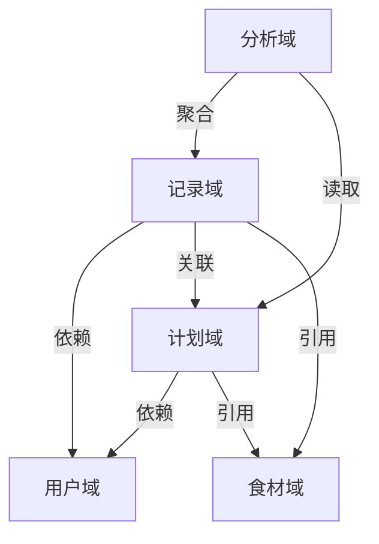

# 01_需求模块化方案

## 1. 业务域划分 (Business Domains)

根据需求文档分析，系统可划分为以下 5 个核心业务域：

| 业务域 | 标识 | 职责描述 | 关键实体 |
| :--- | :--- | :--- | :--- |
| **用户域** | `User` | 处理用户身份认证、个人档案管理及健康数据（BMR/TDEE/体重）管理。 | `User`, `HealthProfile`, `WeightLog` |
| **计划域** | `Plan` | 核心业务。管理饮食计划的生命周期（创建、激活、暂停、归档）、周期设定及日模板配置。 | `DietPlan`, `PlanTemplate`, `CarbCycleConfig` |
| **食材域** | `Food` | 提供基础食材数据支持，包括系统预设库和用户自定义食材。 | `FoodItem`, `CustomFood` |
| **记录域** | `Record` | 用户的日常操作域。记录每日四餐的摄入情况，并与计划目标进行对比。 | `DailyRecord`, `MealLog` |
| **分析域** | `Analysis` | 基于记录数据提供统计报表和趋势分析。 | `WeeklyStats` |

---

## 2. 模块依赖关系 (Dependency Graph)

---

## 3. 功能模块详细定义

### 3.1 用户认证模块 (Auth Module)
- **功能**: 微信一键登录、静默登录、Token 管理、用户信息同步。
- **关联**: 也是所有其他模块的前置依赖。

### 3.2 个人中心模块 (Profile Module)
- **功能**: 个人信息编辑、BMR/TDEE 计算器、体重记录与趋势分析、系统设置。
- **数据**: 存储用户的身高、体重、年龄、活动系数等。

### 3.3 计划管理模块 (Plan Management)
- **功能**:
    - 计划列表（进行中/已完成）。
    - 计划创建向导（普通/碳循环）。
    - 碳循环参数配置。
    - 日模板（DayTemplate）管理（增删改查、复制、排序）。
    - 计划激活/暂停逻辑。

### 3.4 食材库模块 (Food Library)
- **功能**:
    - 系统食材检索（模糊搜索、分类筛选）。
    - 热门/常用食材推荐。
    - 自定义食材创建与管理。
    - 食材收藏。

### 3.5 饮食记录模块 (Diet Log)
- **功能**:
    - 每日仪表盘（今日目标 vs 已摄入）。
    - 餐次记录（早/午/晚/加餐）。
    - 按计划一键打卡（快速记录）。
    - 记录编辑与删除。

### 3.6 数据分析模块 (Analytics)
- **功能**:
    - 本周热量趋势图。
    - 营养素摄入比例分析。
    - 计划完成度统计。

---

## 4. 关键业务流程 (Key Business Flows)

1.  **新用户冷启动**:
    *   登录 -> 个人信息设置 (BMR计算) -> 创建第一个计划 (或导入推荐计划) -> 激活计划 -> 开始记录。

2.  **日常记录循环**:
    *   打开首页 -> 查看今日目标 (基于激活计划的当前日模板) -> 记录餐食 (搜索食材或按计划打卡) -> 查看进度反馈。

3.  **计划调整**:
    *   发现计划不合理 -> 进入计划详情 -> 编辑日模板 (增减食物/调整目标) -> 保存 -> 即时应用到后续日期。
