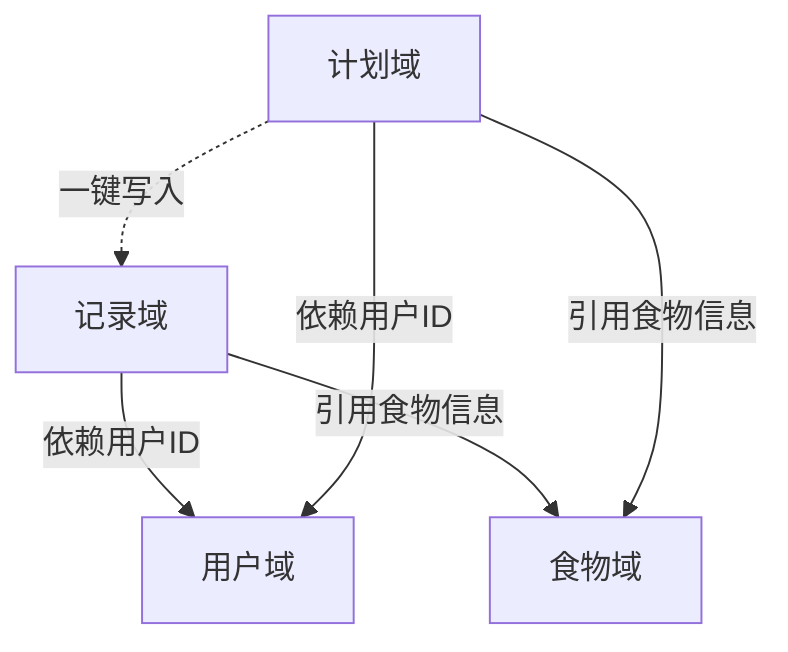

# 需求模块化方案

> **版本**: v1.0
> **日期**: 2026-01-27
> **状态**: 已归档

## 1. 核心业务域划分表

基于对页面功能和业务逻辑的分析，将系统划分为以下 4 个核心业务域：

| 业务域 | 标识 | 核心职责 | 关键实体 |
| :--- | :--- | :--- | :--- |
| **用户域** | `User` | 管理用户身份、个人档案及基础设置 | User, Profile |
| **食物域** | `Food` | 提供基础食物库、自定义食物及营养数据 | Food, CustomFood |
| **记录域** | `Log` | 处理用户每日饮食记录、营养摄入统计 | DietLog, DailySummary |
| **计划域** | `Plan` | 管理饮食计划模板、计划执行与进度追踪 | DietPlan, PlanDay |

## 2. 各业务域详细说明

### 2.1 用户域 (User Domain)
- **职责**: 负责用户登录认证（微信一键登录）、用户信息维护（身高、体重、目标等）、系统设置。
- **功能点**:
  - 微信登录与 Token 管理
  - 用户档案查看与编辑
  - 隐私政策展示
- **交互边界**: 为其他域提供当前用户上下文 (`userId`)。

### 2.2 食物域 (Food Domain)
- **职责**: 作为系统的基础设施，提供标准化的食物营养数据。
- **功能点**:
  - 食物列表展示与搜索
  - 食物详情查看
  - 自定义食物添加（可选）
- **交互边界**: 被**记录域**和**计划域**引用，提供 `foodId` 和营养信息。

### 2.3 记录域 (Log Domain - Core)
- **职责**: 系统的核心高频场景，记录用户每天吃了什么，并计算营养摄入。
- **功能点**:
  - 首页日期导航
  - 按餐次（早/午/晚/加餐）添加食物
  - 每日营养目标（热量/三大营养素）可视化概览
  - 记录的增删改查
- **交互边界**: 引用**用户域**（归属）和**食物域**（数据源）。

### 2.4 计划域 (Plan Domain)
- **职责**: 帮助用户制定长期的饮食目标和食谱。
- **功能点**:
  - 计划列表（进行中/已完成/归档）
  - 创建/编辑计划
  - 导入/分享计划
  - 计划详情与每日食谱预览
  - 将计划食谱“一键记录”到今日饮食
- **交互边界**: 引用**用户域**，并可向**记录域**写入数据（一键记录功能）。

## 3. 域关联与依赖关系图

## 4. 边界上下文映射

- **User Context**: 认证中心，所有请求需携带 Token。
- **Food Context**: 只读数据服务（对普通用户），后台管理数据。
- **Log Context**: 聚合根是“每日记录”，以日期+用户为维度。
- **Plan Context**: 聚合根是“计划”，包含多个“计划日”，每个“计划日”包含多个“餐次”。
