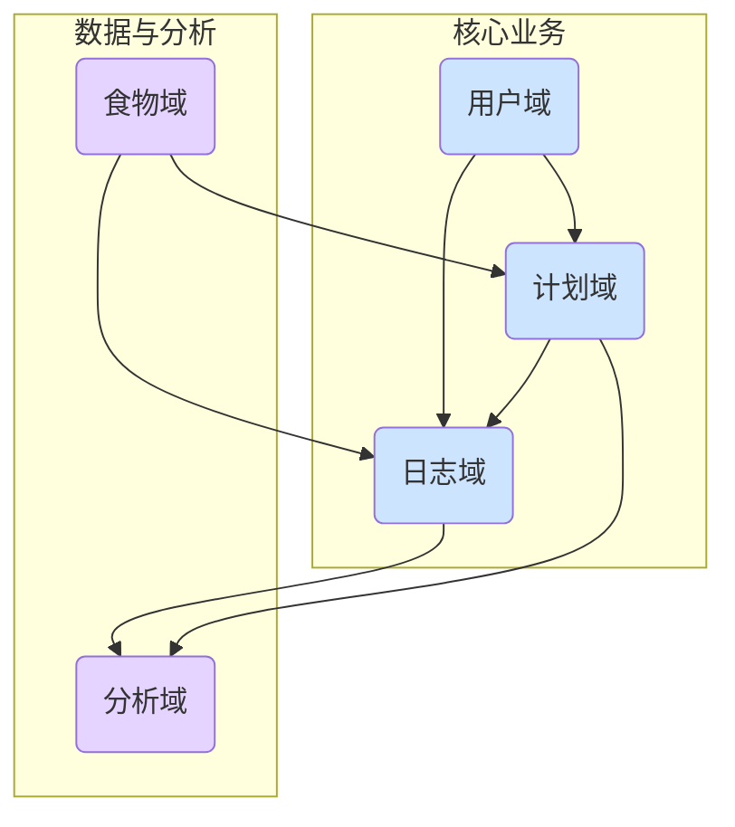

# 需求模块化方案

> **版本**: 1.0  
> **日期**: 2026-01-27  
> **撰写人**: Gemini AI Assistant

## 1. 核心业务域划分表

基于对 `页面功能详细说明文档.md` 的分析，并参考 `00_环境上下文简报.md` 提供的环境上下文，结合领域驱动设计 (DDD) 的思想，将项目业务划分为以下五个核心及支撑业务域。

| 域名称 (Domain Name) | 类型 | 核心职责 (Core Responsibility) | 核心实体 (Core Entities) |
| :--- | :--- | :--- | :--- |
| **用户域 (User)** | 核心域 | 管理用户身份、认证、授权及个人资料。 | `User` |
| **食物域 (Food)** | 支撑域 | 提供标准化的食物数据库，管理食物的营养信息、分类等。 | `Food`, `Nutrient` |
| **计划域 (Plan)** | 核心域 | 负责饮食计划的创建、生命周期管理（激活、暂停、归档）、编辑、分享和导入。 | `DietPlan`, `PlanDay`, `PlanMeal` |
| **日志域 (Log)** | 核心域 | 负责用户每日饮食的记录、查询和修改，是用户最高频的交互域。 | `DietLog`, `MealLog` |
| **分析域 (Analytics)** | 支撑域 | 基于用户的饮食日志和目标，提供数据统计、进度跟踪和可视化分析。 | `DailyGoal` |

---

## 2. 各业务域详细说明

### 2.1 用户域 (User Domain)

- **What (负责什么)**: 此域是系统的基础，负责管理所有与用户身份相关的功能。
- **Why (为什么需要)**: 确保系统安全，为每个用户提供个性化的数据存储和体验。
- **Who (谁会使用)**: 所有访问应用的用户。
- **When (什么场景下使用)**: 用户注册、登录、查看或修改个人信息时。
- **核心实体**:
    - `User`: 存储用户的基本信息，如微信 OpenID、昵称、头像、创建时间等。
- **关键功能**:
    - 微信一键登录与授权
    - 用户信息查询与管理
    - 隐私政策同意记录

### 2.2 食物域 (Food Domain)

- **What (负责什么)**: 管理系统中的所有食物条目及其详细营养成分。
- **Why (为什么需要)**: 为营养计算提供准确、标准化的数据源，是整个应用数据精确性的基石。
- **Who (谁会使用)**: 用户在添加食物时、系统在计算营养时。
- **When (什么场景下使用)**: 用户搜索食物、查看食物详情、系统后台进行营养数据初始化时。
- **核心实体**:
    - `Food`: 代表一个具体的食物，包含名称、分类、单位以及基础营养信息（热量、蛋白质、脂肪、碳水）。
    - `Nutrient`: 值对象，表示食物的营养成分。
- **关键功能**:
    - 食物信息检索（按名称、分类）
    - 食物营养详情展示
    - （未来扩展）用户自定义食物创建

### 2.3 计划域 (Plan Domain)

- **What (负责什么)**: 允许用户创建、管理和分享结构化的饮食计划。计划是未来饮食的"模板"。
- **Why (为什么需要)**: 帮助用户进行系统性、有目标的饮食安排，降低每日记录的复杂度。
- **Who (谁会使用)**: 需要提前规划饮食的用户。
- **When (什么场景下使用)**: 用户创建新的减脂/增肌计划、编辑现有计划、将计划分享给朋友时。
- **核心实体**:
    - `DietPlan`: 代表一个完整的饮食计划，包含名称、周期、目标等。
    - `PlanDay`: 计划中的某一天模板。
    - `PlanMeal`: 某一天中某一餐的食物模板。
- **关键功能**:
    - 创建/编辑/复制/归档/删除计划
    - 激活或暂停计划
    - 通过分享码导入和导出计划

### 2.4 日志域 (Log Domain)

- **What (负责什么)**: 记录用户每日实际摄入的饮食内容。
- **Why (为什么需要)**: 这是追踪用户饮食行为、计算营养摄入、与目标进行对比的核心功能。
- **Who (谁会使用)**: 所有记录日常饮食的用户。
- **When (什么场景下使用)**: 用户每天添加早餐/午餐/晚餐记录，或回顾、修改历史记录时。
- **核心实体**:
    - `DietLog`: 某一天某个用户的一条食物摄入记录，关联到具体食物和数量。
    - `MealLog`: 将多条 `DietLog` 按餐次（早餐、午餐等）聚合的逻辑分组。
- **关键功能**:
    - 按餐次添加/修改/删除食物记录
    - 根据计划模板一键记录整餐
    - 按日期查看历史饮食记录

### 2.5 分析域 (Analytics Domain)

- **What (负责什么)**: 对用户的饮食数据进行处理和分析，提供有价值的反馈。
- **Why (为什么需要)**: 将枯燥的数据转化为直观的图表和进度，激励用户，帮助他们做出更好的饮食决策。
- **Who (谁会使用)**: 关心自己营养达成率和长期趋势的用户。
- **When (什么场景下使用)**: 用户在首页查看今日营养完成度，或在个人中心查看周/月度报告时。
- **核心实体**:
    - `DailyGoal`: 存储用户在某一天或某一计划日的营养目标（热量、蛋白质、脂肪、碳水）。
- **关键功能**:
    - 实时计算并展示当日营养摄入总量与目标的对比
    - 生成日/周/月维度的营养分析报告
    - 可视化展示（如进度条、图表）

---

## 3. 域关联与依赖关系图

**依赖关系说明**:
- **用户域 (User)** 是所有核心域的基础，计划和日志都必须归属于一个用户。
- **食物域 (Food)** 是一个独立的支撑域，它不依赖任何其他域，但被计划域和日志域依赖以获取食物信息。
- **计划域 (Plan)** 依赖食物域来构建计划模板。
- **日志域 (Log)** 依赖食物域来记录具体食物，并且可以（弱依赖）计划域来实现"一键记录"。
- **分析域 (Analytics)** 强依赖日志域的实际摄入数据和计划域的目标数据来进行计算和展示。

---

## 4. 边界上下文映射 (Context Mapping)

- **用户域 (User) 与 计划域/日志域 (Plan/Log)**:
  - **关系**: `上游(User) - 下游(Plan/Log)`。
  - **协作方式**: 计划域和日志域通过 `userId` 消费用户域的身份信息，确保数据隔离。用户域提供 `防腐层(ACL)`，保证其内部模型变化不直接冲击下游。

- **食物域 (Food) 与 计划域/日志域 (Plan/Log)**:
  - **关系**: `上游(Food) - 下游(Plan/Log)`。
  - **协作方式**: 计划域和日志域通过 `foodId` 查询食物域提供的 `开放主机服务(OHS)`。食物域的模型是共享的 (`共享内核 - Shared Kernel`)，其变更会直接影响下游。

- **计划域 (Plan) 与 日志域 (Log)**:
  - **关系**: `上游(Plan) - 下游(Log)`。
  - **协作方式**: 日志域可以订阅计划域的 `计划创建/激活` 事件，或者通过 `客户方-供应方(Customer-Supplier)` 模式，在需要"一键记录"时，主动调用计划域的接口获取当日计划模板。

- **日志域 (Log) 与 分析域 (Analytics)**:
  - **关系**: `上游(Log) - 下游(Analytics)`。
  - **协作方式**: 分析域作为下游，订阅日志域的 `日志记录成功` 事件，异步进行数据统计和分析。这确保了日志记录的高性能，分析的计算压力被隔离。分析域也可以定期轮询日志域的数据进行批量计算。