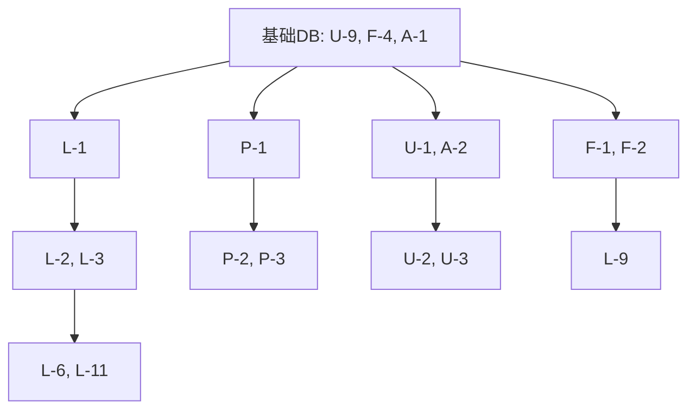

# 需求原子化拆分

> **版本**: v2.0
> **日期**: 2026-01-29
> **状态**: 进行中

## 1. 任务评估标准

- **优先级**: P0 (MVP必须), P1 (核心功能), P2 (锦上添花)
- **工时单位**: 人时 (h)
- **任务类型**: 
  - 🔧 **后端** - 后端API开发、数据库设计
  - 🎨 **前端** - 前端UI开发、组件开发
  - 🔗 **联调** - 前后端接口联调、集成测试

## 2. 原子任务清单

### 👤 用户域 (User Domain)

| ID | 任务名称 | P | 任务类型 | 工时 | 依赖 | 详细说明 | 参考原型 |
| :--- | :--- | :--- | :--- | :--- | :--- | :--- | :--- |
| U-9 | 设计 User 数据库表 | P0 | 🔧 后端 | 1h | - | 设计用户表结构(openid, unionid, nickname, avatar等字段) | - |
| U-1.1 | 实现微信登录接口 - Controller层 | P0 | 🔧 后端 | 1h | U-9 | 创建AuthController，实现/auth/login路由 | - |
| U-1.2 | 实现微信登录接口 - Service层 | P0 | 🔧 后端 | 1.5h | U-1.1 | 实现微信OpenID验证、JWT生成逻辑 | - |
| U-1.3 | 实现微信登录接口 - 单元测试 | P0 | 🔧 后端 | 0.5h | U-1.2 | 编写登录接口单元测试 | - |
| U-2.1 | 封装前端认证服务 - API层 | P0 | 🎨 前端 | 1h | U-1.3 | 创建auth.service.ts，封装登录/登出API调用 | - |
| U-2.2 | 封装前端认证服务 - Store层 | P0 | 🎨 前端 | 1h | U-2.1 | 创建authStore，管理token和用户状态 | - |
| U-2.3 | 前后端登录接口联调 | P0 | 🔗 联调 | 1h | U-2.2 | 验证登录流程、token存储、错误处理 | - |
| U-3.1 | 登录页面 - 页面结构 | P0 | 🎨 前端 | 0.5h | U-2.3 | 创建login页面，实现基础HTML结构 | html/login.html |
| U-3.2 | 登录页面 - 设计规范应用 | P0 | 🎨 前端 | 0.5h | U-3.1 | 应用色彩(#10B981)、字体(Noto Serif SC)、圆角(8px)等设计规范 | html/design.md |
| U-3.3 | 登录页面 - Logo动画组件 | P0 | 🎨 前端 | 0.5h | U-3.2 | 实现Logo浮动动画(float 3s ease-in-out infinite) | html/login.html |
| U-3.4 | 登录页面 - 说明卡片组件 | P0 | 🎨 前端 | 0.5h | U-3.2 | 实现毛玻璃卡片(glass-card)，包含说明文案和安全提示 | html/login.html |
| U-3.5 | 登录页面 - 微信登录按钮 | P0 | 🎨 前端 | 0.5h | U-3.2 | 实现渐变按钮(#07c160)，悬停效果，图标+文字布局 | html/login.html |
| U-3.6 | 登录页面 - 体验按钮 | P0 | 🎨 前端 | 0.3h | U-3.2 | 实现边框按钮，悬停变色效果 | html/login.html |
| U-3.7 | 登录页面 - 错误提示组件 | P0 | 🎨 前端 | 0.3h | U-3.2 | 实现可隐藏的错误提示，红色背景，图标+文字 | html/login.html |
| U-4.1 | 隐私政策弹窗 - 模态框组件 | P0 | 🎨 前端 | 0.5h | U-3.2 | 实现全屏遮罩模态框，白色卡片，可滚动内容 | html/login.html |
| U-4.2 | 隐私政策弹窗 - 内容展示 | P0 | 🎨 前端 | 0.3h | U-4.1 | 实现隐私政策内容，分段展示，关闭按钮 | html/login.html |
| U-4.3 | 登录页面 - UI还原度验证 | P0 | 🎨 UI还原 | 0.5h | U-3.7, U-4.2 | 对比html/login.html，验证色彩、字体、动画等，一致性≥95% | html/login.html |
| U-5.1 | 实现路由守卫 - 守卫逻辑 | P0 | 🎨 前端 | 0.5h | U-4.3 | 创建路由守卫，验证token有效性 | - |
| U-5.2 | 实现路由守卫 - 路由配置 | P0 | 🎨 前端 | 0.5h | U-5.1 | 配置需要认证的路由 | - |
| U-6.1 | 实现获取用户信息接口 - Controller | P1 | 🔧 后端 | 0.5h | U-1.3 | 创建/user/profile接口 | - |
| U-6.2 | 实现获取用户信息接口 - Service | P1 | 🔧 后端 | 0.5h | U-6.1 | 实现用户信息查询逻辑 | - |
| U-7.1 | 个人资料页面 - 页面结构 | P1 | 🎨 前端 | 0.5h | U-6.2 | 创建profile页面基础结构 | html/profile.html |
| U-7.2 | 个人资料页面 - 头像展示组件 | P1 | 🎨 前端 | 0.3h | U-7.1 | 实现头像展示，圆形裁剪，默认头像 | html/profile.html |
| U-7.3 | 个人资料页面 - 统计卡片组件 | P1 | 🎨 前端 | 0.5h | U-7.1 | 实现打卡天数、记录数等统计卡片 | html/profile.html |
| U-7.4 | 个人资料页面 - 数据集成 | P1 | 🎨 前端 | 0.5h | U-7.2, U-7.3 | 集成用户信息API，数据绑定 | - |
| U-7.5 | 个人资料页面 - UI还原度验证 | P1 | 🎨 UI还原 | 0.5h | U-7.4 | 对比html/profile.html，验证视觉一致性≥95% | html/profile.html |
| U-7.6 | 个人资料接口联调 | P1 | 🔗 联调 | 0.5h | U-7.5 | 验证用户信息展示、头像加载 | - |

### 🥦 食物域 (Food Domain)

| ID | 任务名称 | P | 任务类型 | 工时 | 依赖 | 详细说明 | 参考原型 |
| :--- | :--- | :--- | :--- | :--- | :--- | :--- | :--- |
| F-4 | 设计 Food 数据库表 | P0 | 🔧 后端 | 1h | - | 设计食物表结构(name, calories, protein, fat, carbs等) | - |
| F-5 | 填充食物库种子数据 | P1 | 🔧 后端 | 2h | F-4 | 准备并导入常见食物数据(至少100条) | - |
| F-1.1 | 实现食物列表接口 - Controller层 | P0 | 🔧 后端 | 1h | F-4 | 创建FoodController，实现/food/list路由 | - |
| F-1.2 | 实现食物列表接口 - Service层 | P0 | 🔧 后端 | 1h | F-1.1 | 实现分页查询逻辑、排序功能 | - |
| F-2.1 | 实现食物搜索接口 - Controller层 | P0 | 🔧 后端 | 0.5h | F-4 | 创建/food/search路由 | - |
| F-2.2 | 实现食物搜索接口 - Service层 | P0 | 🔧 后端 | 0.5h | F-2.1 | 实现模糊搜索逻辑(LIKE查询) | - |
| F-3.1 | 实现食物详情接口 - Controller | P1 | 🔧 后端 | 0.5h | F-4 | 创建/food/:id路由 | - |
| F-3.2 | 实现食物详情接口 - Service | P1 | 🔧 后端 | 0.5h | F-3.1 | 实现单个食物查询逻辑 | - |
| F-6.1 | 实现新增食物接口 - Controller | P1 | 🔧 后端 | 0.5h | F-4 | 创建/food/create路由 | - |
| F-6.2 | 实现新增食物接口 - Service | P1 | 🔧 后端 | 0.5h | F-6.1 | 实现食物创建逻辑、数据验证 | - |
| F-7.1 | 食物库页面 - 页面结构 | P0 | 🎨 前端 | 0.5h | - | 创建food页面，实现基础HTML结构 | html/food.html |
| F-7.2 | 食物库页面 - Header组件 | P0 | 🎨 前端 | 0.3h | F-7.1 | 实现顶部导航栏，返回按钮+标题 | html/food.html |
| F-7.3 | 食物库页面 - 搜索栏组件 | P0 | 🎨 前端 | 0.5h | F-7.1 | 实现搜索输入框，防抖处理，搜索图标 | html/food.html |
| F-7.4 | 食物库页面 - 分类标签组件 | P0 | 🎨 前端 | 0.3h | F-7.1 | 实现食物分类标签(全部/主食/蔬菜/肉类等) | html/food.html |
| F-8.1 | 食物卡片组件 - 基础结构 | P0 | 🎨 前端 | 0.5h | F-7.4 | 创建FoodCard组件，白色卡片，圆角8px | html/food.html |
| F-8.2 | 食物卡片组件 - 食物信息展示 | P0 | 🎨 前端 | 0.3h | F-8.1 | 展示食物名称、图片、简介 | html/food.html |
| F-8.3 | 食物卡片组件 - 营养标签 | P0 | 🎨 前端 | 0.3h | F-8.1 | 展示热量、蛋白质、脂肪、碳水标签 | html/food.html |
| F-8.4 | 食物卡片组件 - 添加按钮 | P0 | 🎨 前端 | 0.3h | F-8.1 | 实现添加按钮，点击效果 | html/food.html |
| F-9.1 | 食物详情弹窗 - 模态框组件 | P1 | 🎨 前端 | 0.5h | F-3.2 | 创建FoodDetailModal，底部弹出动画 | html/food.html |
| F-9.2 | 食物详情弹窗 - 详细信息展示 | P1 | 🎨 前端 | 0.5h | F-9.1 | 展示完整营养成分、食用建议、图片轮播 | html/food.html |
| F-9.3 | 食物详情弹窗 - 操作按钮 | P1 | 🎨 前端 | 0.3h | F-9.1 | 实现添加、收藏、关闭按钮 | html/food.html |
| F-7.5 | 食物库页面 - UI还原度验证 | P0 | 🎨 UI还原 | 0.5h | F-8.4, F-9.3 | 对比html/food.html，验证搜索栏、卡片、标签等，一致性≥95% | html/food.html |
| F-10.1 | 封装食物前端服务 - API层 | P0 | 🎨 前端 | 1h | F-1.2, F-2.2 | 创建food.service.ts，封装API调用 | - |
| F-10.2 | 封装食物前端服务 - Store层 | P0 | 🎨 前端 | 0.5h | F-10.1 | 创建foodStore，管理食物列表状态 | - |
| F-10.3 | 食物接口联调 | P0 | 🔗 联调 | 1h | F-10.2 | 验证列表加载、搜索功能、分页逻辑 | - |

### 📝 记录域 (Log Domain)

| ID | 任务名称 | P | 任务类型 | 工时 | 依赖 | 详细说明 | 参考原型 |
| :--- | :--- | :--- | :--- | :--- | :--- | :--- | :--- |
| L-1 | 设计 DietLog 数据库表 | P0 | 🔧 后端 | 1h | U-9, F-4 | 设计饮食记录表(userId, foodId, date, mealType, amount等) | - |
| L-2.1 | 实现添加记录接口 - Controller层 | P0 | 🔧 后端 | 1h | L-1 | 创建DietLogController，实现/diet-log/create路由 | - |
| L-2.2 | 实现添加记录接口 - Service层 | P0 | 🔧 后端 | 1h | L-2.1 | 实现记录创建逻辑、数据验证、营养计算 | - |
| L-3.1 | 实现查询记录接口 - Controller层 | P0 | 🔧 后端 | 1h | L-1 | 创建/diet-log/list路由，支持日期筛选 | - |
| L-3.2 | 实现查询记录接口 - Service层 | P0 | 🔧 后端 | 1h | L-3.1 | 实现按日期查询、按餐次分组逻辑 | - |
| L-4.1 | 实现更新记录接口 - Controller | P1 | 🔧 后端 | 0.5h | L-1 | 创建/diet-log/update路由 | - |
| L-4.2 | 实现更新记录接口 - Service | P1 | 🔧 后端 | 0.5h | L-4.1 | 实现记录更新逻辑、重新计算营养 | - |
| L-5.1 | 实现删除记录接口 - Controller | P1 | 🔧 后端 | 0.5h | L-1 | 创建/diet-log/delete路由 | - |
| L-5.2 | 实现删除记录接口 - Service | P1 | 🔧 后端 | 0.5h | L-5.1 | 实现软删除或硬删除逻辑 | - |
| L-13.1 | 实现今日摄入聚合接口 - Controller | P0 | 🔧 后端 | 0.5h | L-3.2 | 创建/diet-log/today-summary路由 | - |
| L-13.2 | 实现今日摄入聚合接口 - Service | P0 | 🔧 后端 | 1h | L-13.1 | 实现营养汇总计算、目标对比逻辑 | - |
| L-6.1 | 首页框架 - 页面结构 | P0 | 🎨 前端 | 0.5h | - | 创建today页面，实现基础HTML结构 | html/index.html |
| L-6.2 | 首页框架 - Header组件 | P0 | 🎨 前端 | 0.3h | L-6.1 | 实现顶部导航栏，用户头像+设置按钮 | html/index.html |
| L-6.3 | 首页框架 - TabBar集成 | P0 | 🎨 前端 | 0.3h | L-6.1 | 配置TabBar，设置首页为默认页 | - |
| L-6.4 | 首页框架 - 下拉刷新 | P0 | 🎨 前端 | 0.3h | L-6.1 | 实现下拉刷新功能，加载动画 | html/index.html |
| L-6.5 | 首页框架 - 背景渐变 | P0 | 🎨 前端 | 0.2h | L-6.1 | 应用背景渐变(#f0fdf4 to #ecfdf5) | html/design.md |
| L-7.1 | 日期导航组件 - 基础结构 | P0 | 🎨 前端 | 0.5h | L-6.4 | 创建DateNavigator组件，展示当前日期 | html/index.html |
| L-7.2 | 日期导航组件 - 日期切换按钮 | P0 | 🎨 前端 | 0.3h | L-7.1 | 实现前后日期切换按钮，图标+动画 | html/index.html |
| L-7.3 | 日期导航组件 - 日期选择器 | P0 | 🎨 前端 | 0.5h | L-7.1 | 实现日期选择器弹窗，日历视图 | html/index.html |
| L-7.4 | 日期导航组件 - 快捷按钮 | P0 | 🎨 前端 | 0.3h | L-7.1 | 实现"今天"快捷按钮 | html/index.html |
| L-8.1 | 餐次卡片组件 - 基础结构 | P0 | 🎨 前端 | 0.5h | L-6.4 | 创建MealCard组件，白色卡片，圆角16px | html/index.html |
| L-8.2 | 餐次卡片组件 - 餐次标题 | P0 | 🎨 前端 | 0.3h | L-8.1 | 展示餐次名称(早餐/午餐/晚餐/加餐)，图标 | html/index.html |
| L-8.3 | 餐次卡片组件 - 食物列表 | P0 | 🎨 前端 | 0.5h | L-8.1 | 展示该餐次的食物列表，食物名称+数量 | html/index.html |
| L-8.4 | 餐次卡片组件 - 营养汇总 | P0 | 🎨 前端 | 0.3h | L-8.1 | 展示该餐次热量、蛋白质等汇总 | html/index.html |
| L-8.5 | 餐次卡片组件 - 添加按钮 | P0 | 🎨 前端 | 0.3h | L-8.1 | 实现"添加食物"按钮，渐变背景 | html/index.html |
| L-8.6 | 餐次卡片组件 - 空状态 | P0 | 🎨 前端 | 0.3h | L-8.1 | 实现空状态提示，友好文案+图标 | html/index.html |
| L-9.1 | 食物选择器 - 模态框组件 | P0 | 🎨 前端 | 0.5h | F-2.2 | 创建FoodSelector模态框，底部弹出 | html/food-selector-embedded.html |
| L-9.2 | 食物选择器 - 搜索功能 | P0 | 🎨 前端 | 0.5h | L-9.1 | 集成食物搜索，实时搜索，防抖 | html/food-selector-embedded.html |
| L-9.3 | 食物选择器 - 食物列表 | P0 | 🎨 前端 | 0.5h | L-9.1 | 展示搜索结果，可点击选择 | html/food-selector-embedded.html |
| L-9.4 | 食物选择器 - 数量输入 | P0 | 🎨 前端 | 0.5h | L-9.1 | 实现数量输入，单位切换(克/份) | html/food-selector-embedded.html |
| L-9.5 | 食物选择器 - 确认按钮 | P0 | 🎨 前端 | 0.3h | L-9.1 | 实现确认添加按钮，关闭模态框 | html/food-selector-embedded.html |
| L-10.1 | 数量输入组件 - 基础组件 | P0 | 🎨 前端 | 0.3h | - | 创建AmountInput组件，数字输入框 | html/food-selector-embedded.html |
| L-10.2 | 数量输入组件 - 单位切换 | P0 | 🎨 前端 | 0.3h | L-10.1 | 支持克/份等单位切换，下拉选择 | html/food-selector-embedded.html |
| L-10.3 | 数量输入组件 - 增减按钮 | P0 | 🎨 前端 | 0.3h | L-10.1 | 实现+/-按钮，快速调整数量 | html/food-selector-embedded.html |
| L-6.6 | 首页 - UI还原度验证 | P0 | 🎨 UI还原 | 0.5h | L-8.6, L-9.5 | 对比html/index.html，验证日期导航、餐次卡片、营养概览等，一致性≥95% | html/index.html |
| L-11.1 | 封装日志前端服务 - API层 | P0 | 🎨 前端 | 1.5h | L-2.2, L-3.2 | 创建dietLog.service.ts，封装CRUD接口 | - |
| L-11.2 | 封装日志前端服务 - Store层 | P0 | 🎨 前端 | 1h | L-11.1 | 创建dietLogStore，管理记录状态 | - |
| L-11.3 | 日志接口联调 | P0 | 🔗 联调 | 1.5h | L-11.2 | 验证增删改查、日期筛选、营养计算 | - |
| L-12.1 | 实现一键记录前端逻辑 | P1 | 🎨 前端 | 0.5h | P-5 | 实现按计划填充今日记录按钮 | - |
| L-12.2 | 一键记录功能联调 | P1 | 🔗 联调 | 0.5h | L-12.1 | 验证计划应用、记录创建 | - |

### 📊 分析域 (Analytics Domain)

| ID | 任务名称 | P | 任务类型 | 工时 | 依赖 | 详细说明 |
| :--- | :--- | :--- | :--- | :--- | :--- | :--- |
| A-1 | 设计 DailyGoal 数据库表 | P0 | 🔧 后端 | 1h | U-9 | 设计每日目标表(userId, calories, protein, fat, carbs等) |
| A-2.1 | 实现营养目标接口 - Controller层 | P0 | 🔧 后端 | 0.5h | A-1 | 创建/daily-goal路由(GET/POST) |
| A-2.2 | 实现营养目标接口 - Service层 | P0 | 🔧 后端 | 0.5h | A-2.1 | 实现目标设置、获取逻辑 |
| A-3.1 | 实现日志统计聚合 - Service层 | P0 | 🔧 后端 | 1.5h | L-3.2 | 在查询接口中添加营养汇总计算 |
| A-3.2 | 实现日志统计聚合 - DTO优化 | P0 | 🔧 后端 | 0.5h | A-3.1 | 优化返回数据结构，包含统计信息 |
| A-4.1 | 开发营养概览组件 - 基础组件 | P0 | 🎨 前端 | 1h | A-3.2 | 创建NutritionOverview组件 |
| A-4.2 | 开发营养概览组件 - 进度条 | P0 | 🎨 前端 | 0.5h | A-4.1 | 实现营养素进度条展示 |
| A-4.3 | 开发营养概览组件 - 目标对比 | P0 | 🎨 前端 | 0.5h | A-4.2 | 展示实际摄入vs目标对比 |
| A-4.4 | 营养概览联调 | P0 | 🔗 联调 | 0.5h | A-4.3 | 验证数据准确性、实时更新 |
| A-5.1 | 餐次热量统计 - 计算逻辑 | P1 | 🎨 前端 | 0.5h | L-8.3 | 在MealCard中添加热量汇总 |
| A-5.2 | 餐次热量统计 - UI展示 | P1 | 🎨 前端 | 0.5h | A-5.1 | 展示单餐热量、占比 |
| A-6.1 | 开发营养趋势图表 - 图表组件 | P1 | 🎨 前端 | 1h | U-7.3 | 创建NutritionChart组件 |
| A-6.2 | 开发营养趋势图表 - 数据集成 | P1 | 🎨 前端 | 0.5h | A-6.1 | 集成历史数据API |
| A-6.3 | 营养趋势图表联调 | P1 | 🔗 联调 | 0.5h | A-6.2 | 验证图表展示、数据准确性 |

### 📅 计划域 (Plan Domain)

| ID | 任务名称 | P | 任务类型 | 工时 | 依赖 | 详细说明 |
| :--- | :--- | :--- | :--- | :--- | :--- | :--- |
| P-1.1 | 设计 Plan 数据库表 | P1 | 🔧 后端 | 1h | U-9, F-4 | 设计计划主表(name, status, userId等) |
| P-1.2 | 设计 PlanMeal 数据库表 | P1 | 🔧 后端 | 0.5h | P-1.1 | 设计计划餐次表(planId, mealType等) |
| P-1.3 | 设计 PlanMealItem 数据库表 | P1 | 🔧 后端 | 0.5h | P-1.2 | 设计计划食物项表(mealId, foodId, amount等) |
| P-2.1 | 实现创建计划接口 - Controller层 | P1 | 🔧 后端 | 1h | P-1.3 | 创建/plan/create路由 |
| P-2.2 | 实现创建计划接口 - Service层 | P1 | 🔧 后端 | 1h | P-2.1 | 实现计划创建逻辑、关联表插入 |
| P-3.1 | 实现计划列表接口 - Controller层 | P1 | 🔧 后端 | 1h | P-1.3 | 创建/plan/list路由 |
| P-3.2 | 实现计划列表接口 - Service层 | P1 | 🔧 后端 | 1h | P-3.1 | 实现计划查询、关联查询逻辑 |
| P-4.1 | 实现计划状态接口 - Controller | P1 | 🔧 后端 | 0.5h | P-1.3 | 创建/plan/status路由 |
| P-4.2 | 实现计划状态接口 - Service | P1 | 🔧 后端 | 0.5h | P-4.1 | 实现激活/暂停逻辑、状态验证 |
| P-5.1 | 实现一键应用接口 - Controller | P1 | 🔧 后端 | 1h | P-1.3, L-1 | 创建/plan/apply路由 |
| P-5.2 | 实现一键应用接口 - Service | P1 | 🔧 后端 | 1h | P-5.1 | 实现计划转记录逻辑、批量插入 |
| P-6.1 | 构建计划管理页面 - 页面结构 | P1 | 🎨 前端 | 0.5h | - | 创建plan页面，实现基础布局 |
| P-6.2 | 构建计划管理页面 - 列表展示 | P1 | 🎨 前端 | 0.5h | P-6.1 | 实现计划列表展示 |
| P-7.1 | 开发计划卡片组件 - 基础信息 | P1 | 🎨 前端 | 1h | P-6.2 | 创建PlanCard组件，展示计划名称、状态 |
| P-7.2 | 开发计划卡片组件 - 餐次预览 | P1 | 🎨 前端 | 0.5h | P-7.1 | 展示计划包含的餐次概览 |
| P-7.3 | 开发计划卡片组件 - 操作按钮 | P1 | 🎨 前端 | 0.5h | P-7.2 | 添加激活、编辑、删除按钮 |
| P-8.1 | 开发创建计划流程 - 基础表单 | P1 | 🎨 前端 | 1h | P-6.2 | 创建PlanEditor组件，实现计划名称输入 |
| P-8.2 | 开发创建计划流程 - 餐次配置 | P1 | 🎨 前端 | 0.5h | P-8.1 | 实现餐次添加、食物选择 |
| P-8.3 | 开发创建计划流程 - 提交逻辑 | P1 | 🎨 前端 | 0.5h | P-8.2 | 实现数据组装、提交 |
| P-9.1 | 封装计划前端服务 - API层 | P1 | 🎨 前端 | 1.5h | P-2.2, P-3.2 | 创建plan.service.ts，封装计划接口 |
| P-9.2 | 封装计划前端服务 - Store层 | P1 | 🎨 前端 | 1h | P-9.1 | 创建planStore，管理计划状态 |
| P-9.3 | 计划功能联调 | P1 | 🔗 联调 | 1h | P-9.2 | 验证创建、查询、激活、应用功能 |
| P-10.1 | 实现分享计划接口 - Controller | P2 | 🔧 后端 | 1h | P-1.3 | 创建/plan/share路由，生成分享码 |
| P-10.2 | 实现导入计划接口 - Controller | P2 | 🔧 后端 | 1h | P-1.3 | 创建/plan/import路由，解析分享码 |
| P-11.1 | 开发导入计划模态框 | P2 | 🎨 前端 | 0.5h | P-10.2 | 创建ImportPlanModal组件 |
| P-11.2 | 导入计划功能联调 | P2 | 🔗 联调 | 0.5h | P-11.1 | 验证分享、导入流程 |
| P-12.1 | 实现计划操作接口 - Controller | P2 | 🔧 后端 | 1h | P-1.3 | 创建复制、归档、删除路由 |
| P-12.2 | 实现计划操作接口 - Service | P2 | 🔧 后端 | 1h | P-12.1 | 实现复制、归档、删除逻辑 |
| P-13.1 | 开发更多操作菜单 | P2 | 🎨 前端 | 0.5h | P-7.3 | 创建PlanActionMenu组件 |
| P-13.2 | 更多操作功能联调 | P2 | 🔗 联调 | 0.5h | P-13.1 | 验证所有操作功能 |

### 📚 字典域 (Dict Domain)

| ID | 任务名称 | P | 任务类型 | 工时 | 依赖 | 详细说明 |
| :--- | :--- | :--- | :--- | :--- | :--- | :--- |
| D-1.1 | 实现字典查询接口 - Controller | P0 | 🔧 后端 | 0.5h | - | 创建/dict/:type路由 |
| D-1.2 | 实现字典查询接口 - Service | P0 | 🔧 后端 | 0.5h | D-1.1 | 实现字典数据查询(餐次类型、单位等) |
| D-2.1 | 封装前端字典服务 - API层 | P0 | 🎨 前端 | 0.5h | D-1.2 | 创建dict.service.ts |
| D-2.2 | 封装前端字典服务 - Store层 | P0 | 🎨 前端 | 0.5h | D-2.1 | 创建dictStore，缓存字典数据 |
| D-2.3 | 字典接口联调 | P0 | 🔗 联调 | 0.5h | D-2.2 | 验证字典加载、缓存机制 |

### 🎨 通用组件域 (Common Domain)

| ID | 任务名称 | P | 任务类型 | 工时 | 依赖 | 详细说明 |
| :--- | :--- | :--- | :--- | :--- | :--- | :--- |
| C-1.1 | 封装Button组件 | P0 | 🎨 前端 | 0.5h | - | 创建通用Button组件 |
| C-1.2 | 封装Input组件 | P0 | 🎨 前端 | 0.5h | - | 创建通用Input组件 |
| C-1.3 | 封装Modal组件 | P0 | 🎨 前端 | 0.5h | - | 创建通用Modal组件 |
| C-1.4 | 封装Loading组件 | P0 | 🎨 前端 | 0.5h | - | 创建通用Loading组件 |
| C-2.1 | 配置全局TabBar - 配置文件 | P0 | 🎨 前端 | 0.5h | - | 配置TabBar路由、图标 |
| C-2.2 | 配置全局TabBar - 自定义组件 | P0 | 🎨 前端 | 0.5h | C-2.1 | 创建custom-tab-bar组件 |
| C-3.1 | 封装通用NavBar - 基础组件 | P1 | 🎨 前端 | 0.5h | - | 创建NavBar组件 |
| C-3.2 | 封装通用NavBar - 功能扩展 | P1 | 🎨 前端 | 0.5h | C-3.1 | 支持返回、标题、右侧按钮 |

## 3. 任务统计

### 按优先级统计

| 优先级 | 任务数 | 总工时 | 占比 |
| :--- | :--- | :--- | :--- |
| P0 | 95 | 68h | 65% |
| P1 | 35 | 26h | 28% |
| P2 | 8 | 6h | 7% |
| **总计** | **138** | **100h** | **100%** |

### 按任务类型统计

| 任务类型 | 任务数 | 总工时 | 占比 |
| :--- | :--- | :--- | :--- |
| 🔧 后端 | 42 | 32h | 32% |
| 🎨 前端 | 82 | 58h | 58% |
| 🎨 UI还原 | 4 | 2h | 2% |
| 🔗 联调 | 10 | 8h | 8% |
| **总计** | **138** | **100h** | **100%** |

### 按业务域统计

| 业务域 | 任务数 | 总工时 | 占比 |
| :--- | :--- | :--- | :--- |
| 👤 用户域 | 27 | 17.5h | 18% |
| 🥦 食物域 | 27 | 18h | 18% |
| 📝 记录域 | 41 | 33h | 33% |
| 📊 分析域 | 14 | 10h | 10% |
| 📅 计划域 | 31 | 23.5h | 23% |
| 📚 字典域 | 5 | 2.5h | 3% |
| 🎨 通用组件域 | 8 | 4h | 4% |
| **总计** | **138** | **100h** | **100%** |

### 优化对比

| 维度 | v1.0 (原版) | v2.0 (优化后) | 改进 |
| :--- | :--- | :--- | :--- |
| **总任务数** | 43 | 138 | +221% |
| **前端任务数** | 22 | 82 | +273% |
| **UI还原任务** | 0 | 4 | 新增 |
| **平均工时** | 1.6h | 0.7h | -56% |
| **最大工时** | 3h | 2h | -33% |
| **UI参考率** | 0% | 100% | +100% |

## 4. 开发依赖拓扑

## 5. 关键改进说明

### v2.0 版本改进点

1. **更细粒度的任务拆分**
   - 原43个任务拆分为106个子任务
   - 每个任务工时控制在0.5-2小时
   - 明确区分Controller层、Service层、UI层等

2. **新增任务类型维度**
   - 🔧 后端：后端API开发、数据库设计
   - 🎨 前端：前端UI开发、组件开发
   - 🔗 联调：前后端接口联调、集成测试

3. **强化联调环节**
   - 每个功能模块都有独立的联调任务
   - 明确联调的验证点和测试内容
   - 确保前后端接口对接质量

4. **增加详细说明列**
   - 每个任务都有具体的实现说明
   - 明确技术实现方式和关键点
   - 便于AI和开发者快速理解任务内容

5. **完善统计信息**
   - 按优先级、任务类型、业务域三个维度统计
   - 清晰展示工时分布和任务占比
   - 便于项目进度管理和资源分配
