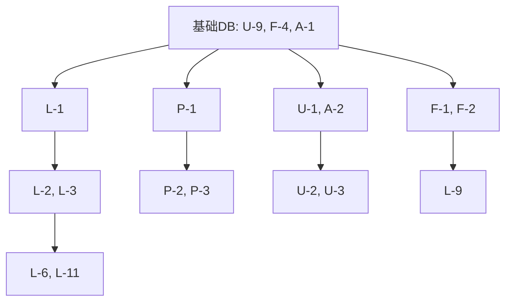

# 需求原子化拆分

> **版本**: v1.0
> **日期**: 2026-01-27
> **状态**: 已归档

## 1. 任务评估标准

- **优先级**: P0 (MVP必须), P1 (核心功能), P2 (锦上添花)
- **工时单位**: 人时 (h)
- **端点**: B (Backend), F (Frontend), S (Shared/DB)

## 2. 原子任务清单

### 👤 用户域 (User Domain)

| ID | 任务名称 | P | 类型 | 工时 | 依赖 |
| :--- | :--- | :--- | :--- | :--- | :--- |
| U-1 | 实现微信登录认证接口 (OpenID/JWT) | P0 | B | 2h | U-9 |
| U-2 | 封装前端认证服务 (Login/Logout/Token) | P0 | F | 2h | U-1 |
| U-3 | 构建登录页面 UI | P0 | F | 1h | - |
| U-4 | 开发登录按钮和隐私政策弹窗组件 | P0 | F | 1h | U-3 |
| U-5 | 实现前端路由守卫 | P0 | F | 1h | U-2 |
| U-6 | 实现获取用户信息接口 | P1 | B | 1h | U-1 |
| U-7 | 构建用户个人资料页面 | P1 | F | 1h | U-6 |
| U-8 | 开发用户资料展示组件 | P1 | F | 1h | U-7 |
| U-9 | 设计 User 数据库表 | P0 | S | 1h | - |

### 🥦 食物域 (Food Domain)

| ID | 任务名称 | P | 类型 | 工时 | 依赖 |
| :--- | :--- | :--- | :--- | :--- | :--- |
| F-1 | 实现食物列表分页查询接口 | P0 | B | 2h | F-4 |
| F-2 | 实现食物名称模糊搜索功能 | P0 | B | 1h | F-4 |
| F-3 | 实现获取单个食物详情接口 | P1 | B | 1h | F-4 |
| F-4 | 设计 Food 数据库表 | P0 | S | 1h | - |
| F-5 | 填充食物库种子数据 | P1 | S | 2h | F-4 |

### 📝 记录域 (Log Domain)

| ID | 任务名称 | P | 类型 | 工时 | 依赖 |
| :--- | :--- | :--- | :--- | :--- | :--- |
| L-1 | 设计 DietLog 数据库表 | P0 | S | 1h | U-9, F-4 |
| L-2 | 实现添加饮食记录接口 | P0 | B | 2h | L-1 |
| L-3 | 实现查询指定日期记录接口 | P0 | B | 2h | L-1 |
| L-4 | 实现更新饮食记录接口 | P1 | B | 1h | L-1 |
| L-5 | 实现删除饮食记录接口 | P1 | B | 1h | L-1 |
| L-6 | 构建首页(今日记录)框架 UI | P0 | F | 2h | - |
| L-7 | 开发日期导航组件 | P0 | F | 1h | L-6 |
| L-8 | 开发餐次卡片组件 (展示列表) | P0 | F | 2h | L-6 |
| L-9 | 开发食物选择模态框 (集成搜索) | P0 | F | 2h | F-2 |
| L-10 | 开发数量输入组件 | P0 | F | 1h | - |
| L-11 | 封装日志前端服务 (Service) | P0 | F | 3h | L-2, L-3 |
| L-12 | 实现按计划一键记录前端逻辑 | P1 | F | 1h | P-5 |

### 📊 分析域 (Analytics Domain)

| ID | 任务名称 | P | 类型 | 工时 | 依赖 |
| :--- | :--- | :--- | :--- | :--- | :--- |
| A-1 | 设计 DailyGoal 数据库表 | P0 | S | 1h | U-9 |
| A-2 | 实现设置/获取营养目标接口 | P0 | B | 1h | A-1 |
| A-3 | 在日志查询接口中聚合当日统计 | P0 | B | 2h | L-3 |
| A-4 | 开发每日营养目标概览组件 | P0 | F | 2h | A-3 |
| A-5 | 餐次卡片显示单餐热量统计 | P1 | F | 1h | L-8 |

### 📅 计划域 (Plan Domain)

| ID | 任务名称 | P | 类型 | 工时 | 依赖 |
| :--- | :--- | :--- | :--- | :--- | :--- |
| P-1 | 设计 Plan 相关数据库表 (3张表) | P1 | S | 2h | U-9, F-4 |
| P-2 | 实现创建饮食计划接口 | P1 | B | 2h | P-1 |
| P-3 | 实现计划列表查询接口 | P1 | B | 2h | P-1 |
| P-4 | 实现计划激活/暂停接口 | P1 | B | 1h | P-1 |
| P-5 | 实现按计划填充今日记录接口 | P1 | B | 2h | P-1, L-1 |
| P-6 | 构建计划管理页面 UI | P1 | F | 1h | - |
| P-7 | 开发计划卡片组件 | P1 | F | 2h | P-6 |
| P-8 | 开发创建/编辑计划流程组件 | P1 | F | 2h | P-6 |
| P-9 | 封装计划前端服务 (Service) | P1 | F | 3h | P-2, P-3 |
| P-10 | 实现分享/导入计划接口 | P2 | B | 2h | P-1 |
| P-11 | 开发导入计划模态框 | P2 | F | 1h | P-10 |
| P-12 | 实现复制/归档/删除接口 | P2 | B | 2h | P-1 |
| P-13 | 计划卡片更多操作菜单 | P2 | F | 1h | P-7 |

## 3. 开发依赖拓扑

