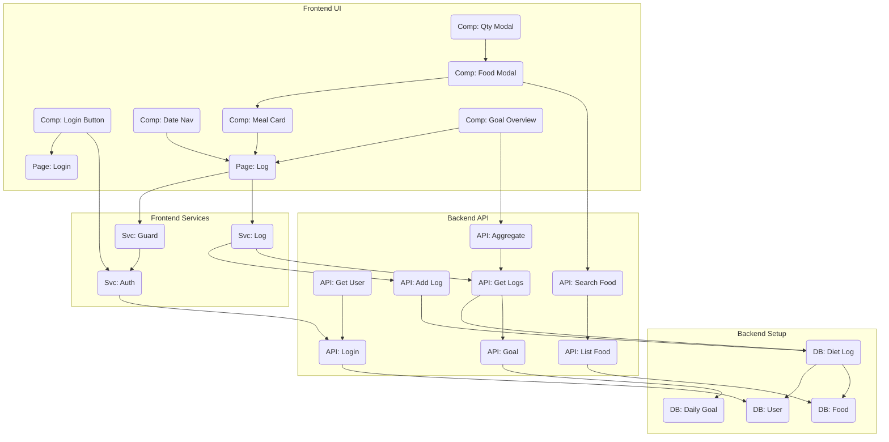

# 需求原子化拆分

> **版本**: 1.0  
> **日期**: 2026-01-27  
> **撰写人**: Gemini AI Assistant

## 1. 任务评估标准说明

- **任务 ID (ID)**: `域首字母-序号` (e.g., U-1, P-2)
- **优先级 (P)**:
    - **P0**: MVP 核心功能，必须完成。
    - **P1**: 重要功能，建议在首版发布后快速迭代。
    - **P2**: 优化和增强功能，可在后续版本考虑。
- **垂直拆分**:
    - `[后端 API]`: 后端接口与业务逻辑。
    - `[前端页面]`: 页面级 UI 与布局。
    - `[前端组件]`: 可复用的 UI 组件。
    - `[前端服务]`: API 调用、状态管理等。
    - `[DB]`: 数据库表结构设计与初始化。
    - `[公共逻辑]`: 跨越多处使用的工具函数、中间件等。
- **预估工时 (时)**: 1 代表 2-4 小时的工作量。
- **复杂度 (C)**: 低 / 中 / 高。
- **涉及端点 (端)**: B (Backend), F (Frontend), S (Shared)。
- **依赖任务 (依赖)**: 完成此任务前必须完成的任务 ID。

---

## 2. 按业务域分组的任务表

### 用户域 (User Domain) - ID 前缀: U

| ID | P | 任务描述 | 垂直拆分 | 时 | C | 端 | 依赖 |
| :--- | :- | :--- | :--- | :- | :-- | :- | :--- |
| U-1 | P0 | 实现微信登录认证接口 | `[后端 API]` | 2 | 中 | B | `U-9` |
| U-2 | P0 | 实现获取当前用户信息的接口 | `[后端 API]` | 1 | 低 | B | `U-1` |
| U-3 | P0 | 封装前端认证服务（登录、登出、Token 管理） | `[前端服务]` | 2 | 中 | F | `U-1` |
| U-4 | P0 | 构建登录页面 UI | `[前端页面]` | 1 | 低 | F | - |
| U-5 | P0 | 开发登录按钮和隐私政策弹窗组件 | `[前端组件]` | 1 | 低 | F | `U-4` |
| U-6 | P0 | 实现前端路由守卫，保护需登录页面 | `[公共逻辑]` | 1 | 中 | F | `U-3` |
| U-7 | P1 | 构建用户个人资料页面 | `[前端页面]` | 1 | 低 | F | `U-2` |
| U-8 | P1 | 开发用户资料展示组件 | `[前端组件]` | 1 | 低 | F | `U-7` |
| U-9 | P0 | 设计 `user` 数据库表 | `[DB]` | 1 | 低 | B | - |

### 食物域 (Food Domain) - ID 前缀: F

| ID | P | 任务描述 | 垂直拆分 | 时 | C | 端 | 依赖 |
| :--- | :- | :--- | :--- | :- | :-- | :- | :--- |
| F-1 | P0 | 实现食物列表分页查询接口 | `[后端 API]` | 2 | 中 | B | `F-4` |
| F-2 | P0 | 实现食物名称模糊搜索功能 | `[后端 API]` | 1 | 中 | B | `F-1` |
| F-3 | P1 | 实现获取单个食物详情接口 | `[后端 API]` | 1 | 低 | B | `F-4` |
| F-4 | P0 | 设计 `food` 数据库表 | `[DB]` | 1 | 低 | B | - |
| F-5 | P1 | 为 `food` 表填充初始化种子数据 | `[DB]` | 2 | 低 | B | `F-4` |

### 日志域 (Log Domain) - ID 前缀: L

| ID | P | 任务描述 | 垂直拆分 | 时 | C | 端 | 依赖 |
| :--- | :- | :--- | :--- | :- | :-- | :- | :--- |
| L-1 | P0 | 设计 `diet_log` 数据库表 | `[DB]` | 1 | 中 | B | `U-9`, `F-4` |
| L-2 | P0 | 实现添加饮食记录接口 | `[后端 API]` | 2 | 中 | B | `L-1` |
| L-3 | P0 | 实现查询指定日期的饮食记录列表接口 | `[后端 API]` | 2 | 中 | B | `L-1`, `A-2` |
| L-4 | P1 | 实现更新饮食记录接口（如修改份量） | `[后端 API]` | 1 | 中 | B | `L-1` |
| L-5 | P1 | 实现删除饮食记录接口 | `[后端 API]` | 1 | 低 | B | `L-1` |
| L-6 | P0 | 构建饮食记录主页面（首页）UI | `[前端页面]` | 2 | 中 | F | - |
| L-7 | P0 | 开发日期导航组件（切换前后天） | `[前端组件]` | 1 | 低 | F | `L-6` |
| L-8 | P0 | 开发餐次记录卡片组件（含食物列表） | `[前端组件]` | 2 | 中 | F | `L-6` |
| L-9 | P0 | 开发食物选择模态框（调用食物搜索） | `[前端组件]` | 2 | 中 | F | `F-2`, `L-8`|
| L-10 | P0| 开发摄入量输入模态框 | `[前端组件]` | 1 | 中 | F | `L-9` |
| L-11 | P0| 封装前端日志服务（获取、添加、删改记录）| `[前端服务]` | 3 | 中 | F | `L-2`,`L-3` |
| L-12 | P1| 实现按计划模板一键记录功能的前端调用 | `[前端服务]` | 1 | 中 | F | `P-11` |

### 分析域 (Analytics Domain) - ID 前缀: A

| ID | P | 任务描述 | 垂直拆分 | 时 | C | 端 | 依赖 |
| :--- | :- | :--- | :--- | :- | :-- | :- | :--- |
| A-1 | P0 | 设计 `daily_goal` 数据库表 | `[DB]` | 1 | 低 | B | `U-9` |
| A-2 | P0 | 实现设置/获取用户每日营养目标的接口 | `[后端 API]` | 1 | 低 | B | `A-1` |
| A-3 | P0 | 在查询日志接口(L-3)中聚合计算当日营养总和| `[后端 API]` | 2 | 中 | B | `L-3`, `A-2` |
| A-4 | P0 | 开发每日营养目标概览组件（进度条） | `[前端组件]` | 2 | 中 | F | `L-6`, `L-11`|
| A-5 | P1 | 在餐次卡片组件(L-8)中显示单餐总热量 | `[前端组件]` | 1 | 低 | F | `L-8`, `A-3` |

### 计划域 (Plan Domain) - ID 前缀: P

| ID | P | 任务描述 | 垂直拆分 | 时 | C | 端 | 依赖 |
| :--- | :- | :--- | :--- | :- | :-- | :- | :--- |
| P-1 | P1 | 设计计划相关数据库表 (`plan`, `plan_day` 等) | `[DB]` | 2 | 高 | B | `U-9`, `F-4`|
| P-2 | P1 | 实现创建新饮食计划接口 | `[后端 API]` | 2 | 高 | B | `P-1` |
| P-3 | P1 | 实现查询用户所有计划的列表接口 | `[后端 API]` | 2 | 中 | B | `P-1` |
| P-4 | P1 | 实现激活/暂停计划接口 | `[后端 API]` | 1 | 中 | B | `P-1` |
| P-5 | P1 | 实现按计划模板填充餐次记录的接口 | `[后端 API]` | 2 | 高 | B | `P-1`, `L-1` |
| P-6 | P1 | 构建计划管理页面 UI | `[前端页面]` | 1 | 中 | F | - |
| P-7 | P1 | 开发计划卡片组件（展示计划摘要和操作） | `[前端组件]` | 2 | 中 | F | `P-6` |
| P-8 | P1 | 开发创建/编辑计划模态框 | `[前端组件]` | 2 | 高 | F | `P-6` |
| P-9 | P1 | 封装前端计划服务（获取、创建、激活等） | `[前端服务]` | 3 | 中 | F | `P-2`,`P-3` |
| P-10| P2 | 实现分享/导入计划接口 | `[后端 API]` | 2 | 高 | B | `P-1` |
| P-11| P2 | 开发导入计划模态框 | `[前端组件]` | 1 | 中 | F | `P-10` |
| P-12| P2 | 实现复制、归档、删除计划接口 | `[后端 API]` | 2 | 中 | B | `P-1` |
| P-13| P2 | 在计划卡片中实现更多操作（复制、删除等） | `[前端组件]` | 1 | 中 | F | `P-7`, `P-12`|

---

## 3. 任务依赖关系图 (MVP - P0 任务)

---

## 4. 开发排期建议 (基于 P0 任务)

### 第一阶段: 后端基础与认证 (可并行)
1.  **DB 建设**: `U-9`, `F-4`, `A-1`, `L-1`
2.  **用户认证**: `U-1`, `U-2`
3.  **食物接口**: `F-1`, `F-2`
4.  **目标接口**: `A-2`

### 第二阶段: 前端认证与日志核心后端
1.  **日志接口**: `L-2`, `L-3`, `A-3`
2.  **前端登录**: `U-4`, `U-5`, `U-3`, `U-6`

### 第三阶段: 前端日志功能闭环
1.  **页面搭建**: `L-6`, `L-7`, `L-8`, `A-4`
2.  **核心服务**: `L-11`
3.  **添加流程**: `L-9`, `L-10`

完成以上三个阶段即可交付一个可用的 MVP 版本，用户可以登录、记录饮食并查看营养统计。后续可在此基础上迭代 P1 和 P2 功能。
