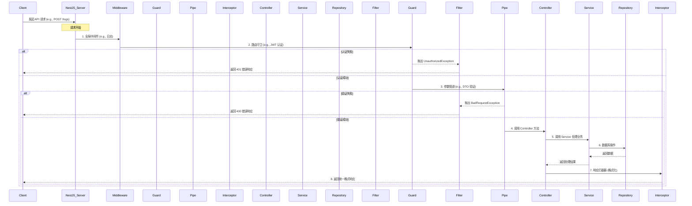
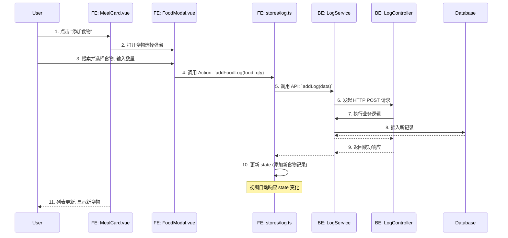

# 系统架构设计方案

> **版本**: 1.0  
> **日期**: 2026-01-27  
> **撰写人**: Gemini AI Assistant

## 1. 总体架构说明

项目采用 **Monorepo** (单仓库) 模式进行管理，包含两个独立的应用包：

- **`fit_cycle_app`**: 后端服务，基于 **NestJS** 构建。
- **`fit_cycle_web`**: 前端应用，基于 **Taro + Vue 3** 构建，支持微信小程序和 H5。

这种结构便于统一管理代码、依赖和构建流程，同时保持前后端的技术栈解耦。

---

## 2. 后端架构 (fit_cycle_app)

### 2.1 分层结构与职责

后端遵循标准的 **NestJS 分层架构**，实现关注点分离。

```
fit_cycle_app/
└── src/
    ├── modules/
    │   └── user/
    │       ├── user.controller.ts  # 1. 控制器 (Controller)
    │       ├── user.service.ts     # 2. 服务层 (Service)
    │       ├── user.module.ts      # 3. 模块 (Module)
    │       └── ...
    ├── database/
    │   └── entity/
    │       └── user.entity.ts      # 4. 实体 (Entity)
    └── dtos/
        └── user.dto.ts             # 5. 数据传输对象 (DTO)
```

1.  **Controller 层**:
    - **职责**: 接收和解析 HTTP 请求，调用 Service 层处理业务，返回响应。**不包含任何业务逻辑**。
    - **规范**: 使用 `@Controller` 装饰器，通过 `@Body()`, `@Query()`, `@Param()` 等装饰器配合 DTO 接收参数。
2.  **Service 层**:
    - **职责**: 处理核心业务逻辑，如数据计算、整合、调用外部服务等。通过依赖注入使用 Repository 进行数据持久化。
    - **规范**: 使用 `@Injectable()` 装饰器，遵循单一职责原则。
3.  **Repository 层 (由 TypeORM 提供)**:
    - **职责**: 与数据库直接交互，执行 CRUD (增删改查) 操作。
    - **规范**: 在 Service 层中通过 `@InjectRepository(User)` 注入，不直接在 Controller 中使用。
4.  **Entity 层**:
    - **职责**: 定义数据库表结构和实体间的关系。
    - **规范**: 使用 `@Entity()` 和 TypeORM 的列/关系装饰器。

### 2.2 请求处理生命周期

下图展示了一个请求从进入应用到返回响应的完整流程。



### 2.3 核心机制设计

1.  **全局异常处理**:
    - **方案**: 创建 `src/common/filters/http-exception.filter.ts`，使用 `@Catch(HttpException)` 捕获所有 HTTP 异常。
    - **目的**: 统一处理业务异常和框架异常，记录错误日志，并返回统一的错误响应格式。
    - **示例**:
      ```typescript
      // main.ts
      app.useGlobalFilters(new HttpExceptionFilter(logger));
      ```

2.  **统一响应格式**:
    - **方案**: 创建 `src/common/interceptors/transform.interceptor.ts`，拦截所有成功返回的响应。
    - **目的**: 将 Controller 的返回值包装成 `{ "code": 200, "data": ..., "message": "success" }` 的标准格式。
    - **示例**:
      ```typescript
      // main.ts
      app.useGlobalInterceptors(new TransformInterceptor());
      ```

3.  **DTO 自动校验**:
    - **方案**: 全局应用 NestJS 内置的 `ValidationPipe`。
    - **目的**: 自动校验所有进入 Controller 的 DTO，未通过验证则直接抛出 400 异常，无需在 Controller 中编写 `if-else` 判断。
    - **示例**:
      ```typescript
      // main.ts
      app.useGlobalPipes(new ValidationPipe({ whitelist: true, transform: true }));
      ```

4.  **认证与授权**:
    - **方案**: 使用 Passport.js 的 JWT 策略。创建 `JwtStrategy` 验证 Token，创建 `JwtAuthGuard` 作为路由守卫。
    - **目的**: 通过 `@UseGuards(JwtAuthGuard)` 装饰器保护需要登录才能访问的接口。
    - **示例**:
      ```typescript
      // user.controller.ts
      @UseGuards(JwtAuthGuard)
      @Get('profile')
      getProfile(@Request() req) {
        return req.user;
      }
      ```

---

## 3. 前端架构 (fit_cycle_web)

### 3.1 目录结构规范

前端将遵循模块化和功能优先的原则组织目录。

```
fit_cycle_web/
└── src/
    ├── pages/          # 页面级组件，对应路由
    │   └── index/
    │       └── index.vue
    ├── components/     # 可复用业务/UI组件
    │   ├── common/         # 全局通用组件 (e.g., CustomButton)
    │   └── daily-list/     # 页面级业务组件 (e.g., MealCard)
    ├── services/       # API 服务
    │   ├── http.ts         # axios/Taro.request 封装
    │   └── modules/
    │       └── user.ts     # 按模块划分的 API 调用
    ├── stores/         # Pinia 状态管理
    │   └── user.ts
    ├── router/         # 路由配置与守卫
    │   └── index.ts
    ├── utils/          # 通用工具函数 (e.g., date, storage)
    ├── constants/      # 常量定义 (e.g., API 路径, 枚举)
    └── app.ts          # 应用入口
```

### 3.2 状态管理策略 (Pinia)

- **设计原则**: 每个业务域（或高内聚的功能模块）创建一个独立的 Store。
- **职责划分**:
    - `state`: 存储响应式数据，是唯一的数据源。
    - `getters`: 派生状态，相当于计算属性。
    - `actions`: 提交状态变更，可包含异步逻辑（如 API 调用）。
- **示例 (`stores/user.ts`)**:
  ```typescript
  import { defineStore } from 'pinia';
  import { login as apiLogin } from '@/services/modules/auth';

  export const useUserStore = defineStore('user', {
    state: () => ({
      token: null as string | null,
      userInfo: null as UserInfo | null,
    }),
    getters: {
      isLoggedIn: (state) => !!state.token,
    },
    actions: {
      async login(code: string) {
        const response = await apiLogin(code);
        this.token = response.accessToken;
        this.userInfo = response.user;
        // 持久化...
      },
      logout() {
        this.token = null;
        this.userInfo = null;
        // 清理持久化...
      },
    },
  });
  ```

### 3.3 路由与鉴权

- **方案**: 使用 Taro 自带的路由功能，并在 `app.ts` 或路由封装中实现全局前置守卫。
- **逻辑**: 在路由跳转前，检查目标路径是否需要认证。如果需要，则从 `userStore` 中检查 `isLoggedIn` 状态。若未登录，则重定向到登录页。
- **示例 (`router/hooks.ts`)**:
  ```typescript
  import Taro from '@tarojs/taro';
  import { useUserStore } from '@/stores/user';
  
  const
   loginPath = '/pages/login/index';
  const requiresAuth = (path: string) => !['/pages/login/index'].includes(path);
  
  export function registerRouteGuards() {
    Taro.addInterceptor(Taro.interceptors.router.callBack, (chain) => {
      const userStore = useUserStore();
      const { url } = chain.request;
      
      if (requiresAuth(url) && !userStore.isLoggedIn) {
        Taro.navigateTo({ url: loginPath });
        return Promise.reject();
      }
      return chain.proceed(chain.request);
    });
  }
  ```

### 3.4 样式方案

- **Tailwind CSS**: 作为主力，用于快速构建 UI。遵循 **utility-first** 原则，直接在模板中编写原子类。
- **Sass**: 作为补充，用于处理 Tailwind 难以实现的复杂逻辑，如需要 `scoped` 的动态样式、动画定义或维护主题变量。

---

## 4. 通用组件/逻辑设计概要

- **可复用组件**: 根据 `02_需求原子化拆分.md`，以下组件具备高复用性，应优先开发：
    - `MealCard`: 餐次卡片。
    - `PlanCard`: 计划卡片。
    - `DateNavigation`: 日期导航。
    - `DailyGoalsOverview`: 每日目标概览。
    - `FoodSelectionModal`: 食物选择弹窗。
- **通用服务**:
    - `services/http.ts`: 封装 `Taro.request`，统一处理请求头（如 `Authorization`）、响应拦截（错误处理）、加载状态等。
    - `utils/storage.ts`: 封装 `Taro.setStorage/getStorage`，提供类型安全的、带前缀的本地存储访问。
    - `utils/error-handler.ts`: 全局错误处理函数，用于上报和用户提示。

---

## 5. 数据流设计

以 "用户在首页添加一个食物" 为例，数据流如下：



---

## 6. 开发规范速查表

| 类别 | 规范 | 示例/工具 |
| :--- | :--- | :--- |
| **命名** | 后端文件 `kebab-case`，前端组件 `PascalCase` | `user.service.ts` / `UserProfile.vue` |
| **Git** | `feat(scope): subject` | `feat(backend): add user login api` |
| **后端** | Controller -> Service -> Repository | - |
| **验证** | DTO + `class-validator` + `ValidationPipe` | `@IsString()`, `@IsNotEmpty()` |
| **前端** | Composition API, `<script setup>` | `const props = defineProps()` |
| **状态** | Pinia: `state`, `getters`, `actions` | `useUserStore()` |
| **样式** | Tailwind CSS 优先, Sass 补充 | `<view class="text-blue-500">` |
| **测试** | Jest, 核心业务覆盖率 > 90% | `describe(...)`, `it(...)` |
