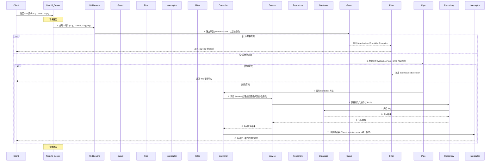
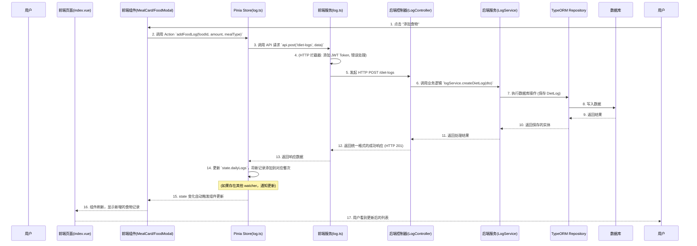

# 系统架构设计方案

> **版本**: 1.0  
> **日期**: 2026-01-27  
> **撰写人**: Gemini AI Assistant

## 1. 总体架构说明

项目采用 **Monorepo** (单仓库) 模式进行管理，包含两个独立的应用包：

- **`fit_cycle_app`**: 后端服务，基于 **NestJS** 构建。
- **`fit_cycle_web`**: 前端应用，基于 **Taro + Vue 3** 构建，支持微信小程序和 H5。

这种结构便于统一管理代码、依赖和构建流程，同时保持前后端的技术栈解耦。所有开发将严格遵循 `编码规范.md` 和 `00_环境上下文简报.md` 中定义的规范。

---

## 2. 后端架构 (fit_cycle_app)

### 2.1 分层结构与职责

后端遵循标准的 **NestJS 分层架构**，实现关注点分离。

```
fit_cycle_app/
└── src/
    ├── modules/
    │   └── user/
    │       ├── user.controller.ts  # 1. 控制器 (Controller)
    │       ├── user.service.ts     # 2. 服务层 (Service)
    │       ├── user.module.ts      # 3. 模块 (Module)
    │       └── ...
    ├── database/
    │   └── entity/
    │       └── user.entity.ts      # 4. 实体 (Entity)
    └── dtos/
        └── user.dto.ts             # 5. 数据传输对象 (DTO)
```

1.  **Controller 层**:
    -   **职责**: 接收和解析 HTTP 请求，调用 Service 层处理业务，返回响应。**不包含任何业务逻辑**。
    -   **规范**: 使用 `@Controller` 装饰器，通过 `@Body()`, `@Query()`, `@Param()` 等装饰器配合 DTO 接收参数，并添加 Swagger 文档注释。
2.  **Service 层**:
    -   **职责**: 处理核心业务逻辑，如数据计算、整合、调用外部服务等。通过依赖注入使用 Repository 进行数据持久化。
    -   **规范**: 使用 `@Injectable()` 装饰器，遵循单一职责原则，使用事务确保数据一致性。
3.  **Repository 层 (由 TypeORM 提供)**:
    -   **职责**: 与数据库直接交互，执行 CRUD (增删改查) 操作。
    -   **规范**: 在 Service 层中通过 `@InjectRepository(User)` 注入，不直接在 Controller 中使用。
4.  **Entity 层**:
    -   **职责**: 定义数据库表结构和实体间的关系。
    -   **规范**: 使用 `@Entity()` 和 TypeORM 的列/关系装饰器，定义主键和时间戳字段。

### 2.2 请求处理生命周期

下图展示了一个请求从进入应用到返回响应的完整流程。



### 2.3 核心机制设计

1.  **全局异常处理**:
    -   **方案**: 实现 `src/common/filters/http-exception.filter.ts`，使用 `@Catch(HttpException)` 捕获所有 HTTP 异常，并根据异常类型（如 `NotFoundException`, `BadRequestException` 等）返回规范的错误响应。
    -   **目的**: 统一处理业务和框架异常，记录错误日志 (`Winston`)，防止敏感信息泄露，提供友好的错误反馈。
    -   **示例**:
        ```typescript
        // main.ts
        import { HttpExceptionFilter } from './src/common/filters/http-exception.filter';
        // ...
        app.useGlobalFilters(new HttpExceptionFilter(app.get(WINSTON_MODULE_NEST_PROVIDER)));
        ```

2.  **统一响应格式**:
    -   **方案**: 实现 `src/common/interceptors/transform.interceptor.ts`。这是一个全局拦截器，它会在 Controller 方法执行成功后，将返回值包装成 `{ "code": 200, "data": ..., "message": "success" }` 的标准格式。
    -   **目的**: 确保所有成功的 API 响应都具有一致的结构，简化前端处理逻辑。
    -   **示例**:
        ```typescript
        // main.ts
        import { TransformInterceptor } from './src/common/interceptors/transform.interceptor';
        // ...
        app.useGlobalInterceptors(new TransformInterceptor());
        ```

3.  **DTO 自动校验**:
    -   **方案**: 在 `main.ts` 中全局应用 NestJS 内置的 `ValidationPipe`，配合 `class-validator` 和 `class-transformer` 装饰器。
    -   **目的**: 自动对 Controller 接收的 DTO 参数进行校验。如果验证失败，`ValidationPipe` 会自动抛出 `BadRequestException` (被 `HttpExceptionFilter` 捕获)，无需手动检查。
    -   **示例**:
        ```typescript
        // main.ts
        import { ValidationPipe } from '@nestjs/common';
        // ...
        app.useGlobalPipes(new ValidationPipe({ 
            whitelist: true, // 移除DTO中未定义的属性
            transform: true, // 自动转换参数类型
            forbidNonWhitelisted: true // 禁止非白名单属性
        }));
        ```

4.  **认证与授权**:
    -   **方案**: 基于 `Passport.js` 和 `JWT` 策略。定义 `JwtStrategy` (验证 Token 有效性，提取用户信息) 和 `JwtAuthGuard` (保护路由)。
    -   **目的**: 通过 `@UseGuards(JwtAuthGuard)` 装饰器保护需要用户登录后才能访问的 API 接口。
    -   **示例**:
        ```typescript
        // user.controller.ts
        import { UseGuards, Request, Get } from '@nestjs/common';
        import { JwtAuthGuard } from '../auth/guards/jwt-auth.guard'; // 假设路径
        // ...
        @UseGuards(JwtAuthGuard)
        @Get('profile')
        getProfile(@Request() req) {
          return req.user; // req.user 会被 JwtAuthGuard 注入
        }
        ```

5.  **日志记录**:
    -   **方案**: 使用 `nest-winston` 集成 `Winston` 日志系统。配置多传输器 (文件、控制台)，实现按日期轮转和不同级别日志文件。
    -   **目的**: 记录应用运行状态、错误信息、请求追踪等，便于问题排查和系统监控。
    -   **示例**: (winston.config.ts)
        ```typescript
        // src/common/logger/winston.config.ts
        import * as winston from 'winston';
        import 'winston-daily-rotate-file';
        // ...配置 transports...
        export const winstonLogger = winston.createLogger({ /* ... */ });
        ```

6.  **事务管理**:
    -   **方案**: 利用 TypeORM 的 `EntityManager` 或 `@Transactional` 装饰器 (如果有自定义实现)。在 Service 层中需要执行多个数据库操作以保持数据一致性时使用。
    -   **目的**: 确保一组数据库操作要么全部成功，要么全部失败，维护数据完整性。
    -   **示例**:
        ```typescript
        // user.service.ts
        import { DataSource } from 'typeorm';
        // ...
        async createWithTransaction(createUserDto: CreateUserDto) {
          return this.dataSource.transaction(async manager => {
            // manager.save(user);
            // manager.save(profile);
          });
        }
        ```

---

## 3. 前端架构 (fit_cycle_web)

### 3.1 目录结构规范

前端将遵循模块化和功能优先的原则组织目录。

```
fit_cycle_web/
└── src/
    ├── pages/          # 页面级组件，对应路由 (如 /pages/login/index.vue)
    │   ├── login/
    │   │   └── index.vue   # 对应 html/login.html
    │   └── index/
    │       └── index.vue   # 对应 html/index.html
    ├── components/     # 可复用业务/UI组件 (从 html/ 中抽象)
    │   ├── common/         # 全局通用组件 (e.g., CustomButton)
    │   ├── daily-list/     # 页面级业务组件 (e.g., MealCard - 从 index.html 抽象)
    │   ├── plan/           # 计划相关的组件 (e.g., PlanCard - 从 plan.html 抽象)
    │   └── auth/           # 认证相关组件 (e.g., LoginButton, PrivacyModal - 从 login.html 抽象)
    ├── services/       # API 服务封装与模块化
    │   ├── http.ts         # axios/Taro.request 封装
    │   └── modules/
    │       ├── auth.ts     # 认证相关 API
    │       ├── food.ts     # 食物相关 API
    │       └── ...
    ├── stores/         # Pinia 状态管理 (按业务域划分)
    │   ├── user.ts         # 用户信息、认证状态
    │   ├── food.ts         # 食物数据缓存
    │   └── log.ts          # 每日饮食记录状态
    ├── router/         # 路由配置与守卫
    │   ├── index.ts        # 路由定义
    │   ├── hooks.ts        # 路由守卫逻辑
    │   └── types.ts
    ├── utils/          # 通用工具函数 (e.g., date, storage, error-handler)
    ├── constants/      # 常量定义 (e.g., API 路径, 枚举, 错误码)
    └── app.ts          # 应用入口
```

### 3.2 状态管理策略 (Pinia)

-   **设计原则**: 每个业务域（或高内聚的功能模块）创建一个独立的 Pinia Store，保持 Store 的职责单一。
-   **职责划分**:
    -   `state`: 存储响应式数据，是唯一的数据源。
    -   `getters`: 派生状态，相当于计算属性，用于从 state 中获取计算后的数据。
    -   `actions`: 提交状态变更，可包含异步逻辑（如 API 调用），封装业务操作。
-   **示例 (`stores/user.ts`)**:
    ```typescript
    import { defineStore } from 'pinia';
    import { login as apiLogin, fetchUserProfile } from '@/services/modules/auth'; // 假设路径
    import { setStorage, getStorage, removeStorage } from '@/utils/storage'; // 假设路径
    import { ACCESS_TOKEN_KEY, REFRESH_TOKEN_KEY } from '@/constants/storage'; // 假设路径

    interface UserInfo {
      id: number;
      nickname: string;
      avatarUrl: string;
    }

    export const useUserStore = defineStore('user', {
      state: () => ({
        accessToken: getStorage(ACCESS_TOKEN_KEY, null) as string | null,
        refreshToken: getStorage(REFRESH_TOKEN_KEY, null) as string | null,
        userInfo: null as UserInfo | null,
      }),
      getters: {
        isLoggedIn: (state) => !!state.accessToken,
        getUserInfo: (state) => state.userInfo,
      },
      actions: {
        async login(code: string) {
          const response = await apiLogin(code);
          this.accessToken = response.accessToken;
          this.refreshToken = response.refreshToken; // 假设有
          setStorage(ACCESS_TOKEN_KEY, response.accessToken);
          setStorage(REFRESH_TOKEN_KEY, response.refreshToken);
          await this.loadUserProfile();
        },
        async loadUserProfile() {
            if (this.accessToken && !this.userInfo) {
                this.userInfo = await fetchUserProfile();
            }
        },
        logout() {
          this.accessToken = null;
          this.refreshToken = null;
          this.userInfo = null;
          removeStorage(ACCESS_TOKEN_KEY);
          removeStorage(REFRESH_TOKEN_KEY);
        },
      },
    });
    ```

### 3.3 路由与鉴权

-   **方案**: 利用 Taro 提供的路由 API (如 `Taro.navigateTo`, `Taro.redirectTo`)，并通过 `Taro.addInterceptor` 实现全局路由守卫。
-   **逻辑**: 在 `router/hooks.ts` 中注册路由拦截器。对于需要认证的路由，在跳转前检查 `userStore` 中的 `isLoggedIn` 状态。如果未登录，则中断跳转并重定向到登录页。
-   **示例 (`router/hooks.ts`)**:
    ```typescript
    // src/router/hooks.ts
    import Taro from '@tarojs/taro';
    import { useUserStore } from '@/stores/user';
    import { ROUTE_LOGIN } from '@/constants/routes'; // 假设常量定义

    const whiteList = [ROUTE_LOGIN, '/pages/privacy/index']; // 白名单路由

    export function setupRouterGuards() {
      Taro.addInterceptor('navigateTo', (chain) => {
        const { url } = chain.request;
        const userStore = useUserStore(); // 在 setupRouterGuards 中初始化 Pinia

        if (!whiteList.includes(url) && !userStore.isLoggedIn) {
          Taro.redirectTo({ url: ROUTE_LOGIN });
          return Promise.reject(new Error('未登录，重定向到登录页'));
        }
        return chain.proceed(chain.request);
      });
      // 也可以为 redirectTo, switchTab 等添加拦截器
    }
    ```

### 3.4 样式方案

-   **Tailwind CSS**: 作为主力样式框架，采用 **utility-first** 原则。通过 `weapp-tailwindcss` 插件适配 Taro/小程序环境。主要用于快速构建布局、颜色、字体、间距等原子样式。
-   **Sass**: 作为补充，用于处理 Tailwind CSS 难以直接表达的复杂场景，如：
    -   需要 `scoped` 作用域的组件样式。
    -   定义全局的样式变量 (如主题色)。
    -   复杂的伪类、混合 (mixins) 或嵌套结构。
    -   关键帧动画。
-   **`html/` 分析与对齐**: `html/` 目录中的原型页面展示了预期的 UI 效果。前端开发时，将 `html` 中的静态结构移植到 Vue 模板，并根据 Tailwind CSS 规范将原生的 CSS 样式转换为 Tailwind 类名。对于复杂的、定制化的样式，则采用 Sass。

---

## 4. 通用组件/逻辑设计概要

根据 `02_需求原子化拆分.md` 以及对 `html/` 目录的分析，以下通用组件和逻辑是跨模块、可复用的：

-   **UI 组件**:
    -   `LogoHeader`, `WelcomeCard` (来自 `html/login.html`)
    -   `LoginButton` (来自 `html/login.html`)
    -   `DateNavigation` (来自 `html/index.html`)
    -   `MealCard`, `FoodListItem` (来自 `html/index.html`)
    -   `DailyGoalsOverview` (来自 `html/index.html`)
    -   `FoodSelectionModal`, `QuantityInputModal` (从 `html/food-selector-embedded.html` 和 `页面功能详细说明文档.md` 抽象)
    -   `PlanCard`, `PlanHeader`, `PlanTabs` (来自 `html/plan.html`)
    -   `CreatePlanModal`, `ImportPlanModal` (从 `html/new-plan.html`, `html/plan-creator.html` 和 `html/plan.html` 抽象)
-   **通用服务/工具**:
    -   `services/http.ts`: 封装 `Taro.request`，统一处理请求拦截 (添加 `Authorization` 头)，响应拦截 (统一错误处理，如 401 重定向到登录页)，加载状态管理。
    -   `utils/storage.ts`: 封装 `Taro.setStorage/getStorage/removeStorage`，提供类型安全、带有应用前缀的本地存储操作，避免键冲突。
    -   `utils/error-handler.ts`: 全局错误处理工具，用于将 API 或运行时错误统一转换为用户友好的提示 (`Taro.showToast`)，并记录详细日志。
    -   `utils/toast.ts` / `utils/loading.ts`: 封装 `Taro.showToast` 和 `Taro.showLoading`，提供更简洁的 API。

---

## 5. 数据流设计

以 "用户在首页添加一个食物" 为例，数据流如下：



## 6. 开发规范速查表

| 类别 | 规范 | 示例/工具 | 参考文档 |
| :--- | :--- | :--- | :--- |
| **Monorepo** | 统一项目管理 | Lerna/Nx (当前手动管理) | `GEMINI.md` |
| **命名** | 变量 `camelCase`, 类 `PascalCase`, 常量 `UPPER_SNAKE_CASE` | `userName`, `UserService`, `API_URL` | `编码规范.md` |
| **文件命名** | 后端 `kebab-case`, 前端 `PascalCase` | `user.service.ts`, `UserProfile.vue` | `编码规范.md` |
| **Git 提交** | `<type>(<scope>): <subject>` | `feat(auth): implement login api` | `编码规范.md` |
| **后端分层** | Controller -> Service -> Repository | - | `系统架构设计方案.md` |
| **后端验证** | DTO + `class-validator` + `ValidationPipe` | `@IsString()`, `@IsNotEmpty()` | `编码规范.md` |
| **前端框架** | Vue 3 Composition API | `<script setup lang="ts">` | `编码规范.md` |
| **状态管理** | Pinia: `state`, `getters`, `actions` | `useUserStore()` | `系统架构设计方案.md` |
| **样式** | Tailwind CSS 优先, Sass 补充 | `class="text-blue-500"`, `_variables.scss` | `项目技术栈.md`, `系统架构设计方案.md` |
| **API 调用** | 统一封装 `services/http.ts` | `http.get('/users')` | `系统架构设计方案.md` |
| **路由鉴权** | `Taro.addInterceptor` + Pinia `isLoggedIn` | - | `系统架构设计方案.md` |
| **错误处理** | 全局异常过滤器 (后端), HTTP 拦截器 (前端) | `HttpExceptionFilter` | `系统架构设计方案.md` |
| **日志** | Winston (`nest-winston`) | - | `系统架构设计方案.md` |
| **TypeScript** | `strict` 模式 | `tsconfig.json` | `编码规范.md` |