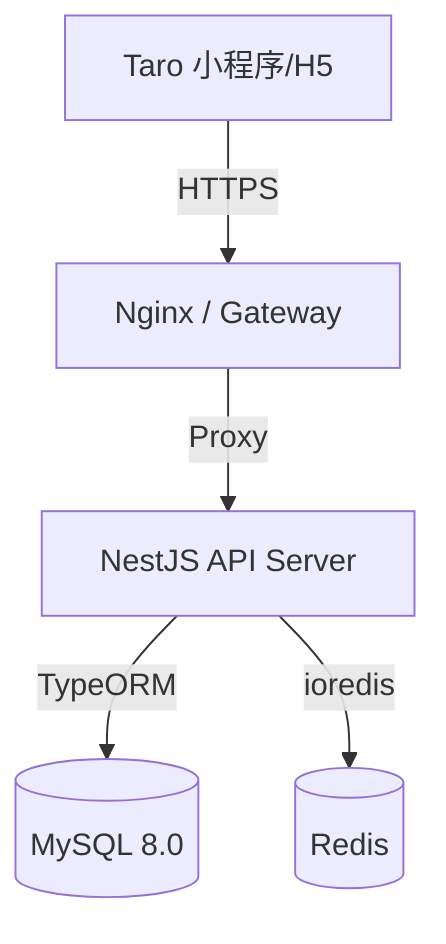

# 03_系统架构设计方案

## 1. 总体架构 (System Overview)

本项目采用 **Monorepo** 模式管理前后端代码，确保接口契约与类型定义的紧密同步。



---

## 2. 后端架构 (Backend Architecture)

基于 **NestJS** 框架，采用模块化分层架构。

### 2.1 模块划分
*   **AppModule**: 根模块，负责全局配置（Config, TypeORM, Redis）加载。
*   **AuthModule**: 负责登录认证、JWT 签发与校验、Guard 守卫。
*   **UserModule**: 用户档案管理、健康数据计算。
*   **FoodModule**: 食材库管理（系统+自定义）。
*   **PlanModule**: 饮食计划核心逻辑（模板、周期、状态）。
*   **RecordModule**: 日常饮食记录与统计。
*   **AnalysisModule**: 数据聚合与报表生成。

### 2.2 核心技术选型
| 技术点 | 选型 | 说明 |
| :--- | :--- | :--- |
| **Framework** | NestJS v10+ | 渐进式 Node.js 框架 |
| **Language** | TypeScript v5+ | 强类型约束 |
| **ORM** | TypeORM | 实体映射与数据库迁移 |
| **Validation** | class-validator | DTO 参数校验 |
| **Documentation** | Swagger | 接口文档自动生成 |
| **Logging** | Winston | 结构化日志记录 |

### 2.3 数据库设计原则
*   使用 **MySQL 8.0** 存储业务数据。
*   所有表具备 `created_at`, `updated_at`, `deleted_at` (软删除)。
*   使用 **utf8mb4_unicode_ci** 字符集。
*   关键查询字段（如 `user_id`, `date`）建立索引。

---

## 3. 前端架构 (Frontend Architecture)

基于 **Taro 4 + Vue 3** 实现多端统一开发。

### 3.1 目录结构
```
src/
├── app.ts              # 入口文件
├── app.config.ts       # 全局配置
├── assets/             # 静态资源
├── components/         # 公共组件 (FoodSearch, DatePicker...)
├── pages/              # 页面视图 (Index, Plan, Food, Profile)
├── stores/             # Pinia 状态管理
├── services/           # API 接口封装
├── utils/              # 工具函数 (request, date, calc)
└── types/              # TypeScript 类型定义
```

### 3.2 核心机制
*   **状态管理**: 使用 **Pinia** 管理全局状态（用户信息、激活计划、今日记录缓存）。
*   **网络请求**: 封装 `Taro.request`，统一处理拦截器、Token 注入、错误提示。
*   **UI 组件库**: 采用 **NutUI Taro** 版本，保证移动端体验。
*   **样式方案**: 使用 **Tailwind CSS** (通过 `weapp-tailwindcss` 适配) 实现原子化样式。

---

## 4. 交互与数据流 (Interaction & Data Flow)

### 4.1 认证流程
1.  前端调用 `wx.login` 获取 Code。
2.  前端 POST Code 至后端 `/auth/login`。
3.  后端换取 OpenID，查找或创建 User，签发 JWT。
4.  前端存储 Token 至 Storage，后续请求 Header 携带 `Authorization: Bearer <token>`。

### 4.2 数据同步策略
*   **读多写少**: 计划与食材数据，前端在初始化时拉取并缓存至 Store，必要时手动刷新。
*   **高频写入**: 饮食记录操作（增删改），采用乐观更新（Optimistic UI）策略——先更新前端视图，再发送请求，失败则回滚。

### 4.3 异常处理
*   **全局过滤器**: 后端使用 `AllExceptionsFilter` 统一捕获异常，返回标准 JSON 格式。
*   **统一错误码**: 定义业务错误码（如 `PLAN_ALREADY_ACTIVE`），前端据此展示友好提示。

---

## 5. 安全设计 (Security)

*   **API 安全**: 全站 HTTPS，JWT 包含有效期与刷新机制。
*   **数据隔离**: 所有业务查询强制带上 `where user_id = ?`，防止越权访问。
*   **输入清洗**: 使用 `ValidationPipe` 自动剔除 DTO 之外的非法字段。
