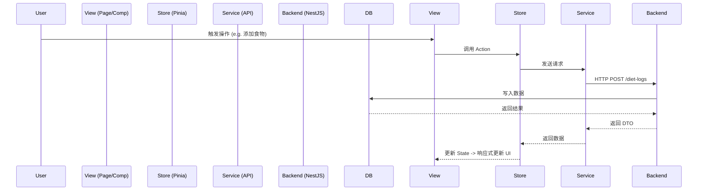

# 系统架构设计方案

> **版本**: v1.0
> **日期**: 2026-01-27
> **状态**: 已归档

## 1. 总体架构

项目采用 Monorepo 结构，统一管理前后端代码：

- **后端 (`fit_cycle_app`)**: 基于 NestJS v11 的 RESTful API 服务。
- **前端 (`fit_cycle_web`)**: 基于 Taro v4 + Vue 3 的跨端小程序/H5 应用。

## 2. 后端架构设计 (NestJS)

### 2.1 分层架构
遵循标准的分层模式：
- **Controller**: 处理 HTTP 请求，参数校验 (DTO)。
- **Service**: 核心业务逻辑，事务管理。
- **Repository**: 数据持久化 (TypeORM)。
- **Entity**: 数据库实体定义。

### 2.2 核心模块划分
| 模块 | 职责 | 依赖 |
| :--- | :--- | :--- |
| `AuthModule` | 登录、JWT 签发与验证 | UserModule |
| `UserModule` | 用户档案管理 | - |
| `FoodModule` | 食物库管理 | - |
| `DietLogModule` | 饮食记录管理 | UserModule, FoodModule |
| `DietPlanModule` | 计划管理 | UserModule, FoodModule |
| `CommonModule` | 全局拦截器、过滤器、工具类 | - |

### 2.3 核心机制
- **认证**: `Passport` + `JWT Strategy`。
- **验证**: 全局 `ValidationPipe` + `class-validator`。
- **响应**: 全局 `TransformInterceptor` 统一返回 `{ code, data, message }`。
- **异常**: 全局 `HttpExceptionFilter` 统一处理错误。
- **日志**: `Winston` 日志系统。

## 3. 前端架构设计 (Taro + Vue 3)

### 3.1 目录结构
```bash
src/
  ├── components/ # 通用组件 & 业务组件
  ├── pages/      # 页面视图
  ├── stores/     # Pinia 状态管理
  ├── services/   # API 封装
  ├── utils/      # 工具函数
  └── app.ts      # 入口
```

### 3.2 状态管理 (Pinia)
- `user`: 用户信息、Token。
- `log`: 今日饮食记录、统计数据。
- `plan`: 计划列表、当前激活计划。

### 3.3 网络请求
封装 `Taro.request` 为 `HttpService` (`src/services/http/index.ts`)：
- **拦截器**: 自动注入 Token，处理 401 过期跳转。
- **适配**: 统一处理多端请求差异。

### 3.4 UI 规范
- **样式**: Tailwind CSS (主要) + SCSS (辅助)。
- **组件库**: NutUI Taro。

## 4. 数据流设计


