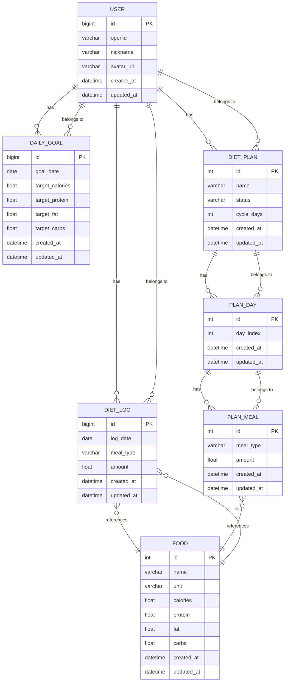

# 接口与数据规约

> **版本**: 1.0  
> **日期**: 2026-01-27  
> **撰写人**: Gemini AI Assistant
> **说明**: 本文档是前后端并行开发的唯一真理来源。

## 1. 数据库实体模型 (TypeORM)

### 1.1 ER 图



### 1.2 核心实体定义

<details>
<summary>User (用户)</summary>

```typescript
// src/database/entity/user.entity.ts
import { Entity, PrimaryGeneratedColumn, Column, CreateDateColumn, UpdateDateColumn, OneToMany } from 'typeorm';
import { DietLog } from './diet-log.entity';

@Entity('users')
export class User {
  @PrimaryGeneratedColumn({ type: 'bigint' })
  id: number;

  @Column({ unique: true })
  openid: string;

  @Column({ length: 100, default: '' })
  nickname: string;

  @Column({ type: 'text', nullable: true })
  avatarUrl: string;

  @OneToMany(() => DietLog, log => log.user)
  logs: DietLog[];

  @CreateDateColumn()
  createdAt: Date;

  @UpdateDateColumn()
  updatedAt: Date;
}
```
</details>

<details>
<summary>Food (食物)</summary>

```typescript
// src/database/entity/food.entity.ts
import { Entity, PrimaryGeneratedColumn, Column, CreateDateColumn, UpdateDateColumn } from 'typeorm';

@Entity('foods')
export class Food {
  @PrimaryGeneratedColumn()
  id: number;

  @Column({ length: 100, comment: '食物名称' })
  name: string;

  @Column({ length: 20, comment: '计量单位 (e.g., g, ml, 个)' })
  unit: string;

  @Column('float', { comment: '每单位热量 (kcal)' })
  calories: number;

  @Column('float', { comment: '每单位蛋白质 (g)' })
  protein: number;
  
  @Column('float', { comment: '每单位脂肪 (g)' })
  fat: number;

  @Column('float', { comment: '每单位碳水 (g)' })
  carbs: number;

  @CreateDateColumn()
  createdAt: Date;

  @UpdateDateColumn()
  updatedAt: Date;
}
```
</details>

<details>
<summary>DietLog (饮食记录)</summary>

```typescript
// src/database/entity/diet-log.entity.ts
import { Entity, PrimaryGeneratedColumn, Column, CreateDateColumn, UpdateDateColumn, ManyToOne } from 'typeorm';
import { User } from './user.entity';
import { Food } from './food.entity';
import { MealType } from '@/constants/enums'; // TBD in Data Dictionary

@Entity('diet_logs')
export class DietLog {
  @PrimaryGeneratedColumn({ type: 'bigint' })
  id: number;

  @ManyToOne(() => User, user => user.logs)
  user: User;

  @ManyToOne(() => Food)
  food: Food;

  @Column({ type: 'date', comment: '记录日期' })
  logDate: string;

  @Column({ type: 'enum', enum: MealType, comment: '餐次类型' })
  mealType: MealType;

  @Column('float', { comment: '摄入量' })
  amount: number;

  @CreateDateColumn()
  createdAt: Date;

  @UpdateDateColumn()
  updatedAt: Date;
}
```
</details>

<details>
<summary>DailyGoal (每日目标)</summary>
```typescript
// src/database/entity/daily-goal.entity.ts
import { Entity, PrimaryGeneratedColumn, Column, CreateDateColumn, UpdateDateColumn, ManyToOne } from 'typeorm';
import { User } from './user.entity';

@Entity('daily_goals')
export class DailyGoal {
    @PrimaryGeneratedColumn({ type: 'bigint' })
    id: number;

    @ManyToOne(() => User)
    user: User;

    @Column({ type: 'date', comment: '目标日期' })
    goalDate: string;

    @Column('float')
    targetCalories: number;

    @Column('float')
    targetProtein: number;

    @Column('float')
    targetFat: number;

    @Column('float')
    targetCarbs: number;

    @CreateDateColumn()
    createdAt: Date;

    @UpdateDateColumn()
    updatedAt: Date;
}
```
</details>

---
## 2. 数据字典 (Data Dictionary)

- **餐次类型 (MealType)**
  ```typescript
  export enum MealType {
    BREAKFAST = 'breakfast',
    LUNCH = 'lunch',
    DINNER = 'dinner',
    SNACK = 'snack',
  }
  ```
- **计划状态 (PlanStatus)**
  ```typescript
  export enum PlanStatus {
    ACTIVE = 'active',
    PAUSED = 'paused',
    COMPLETED = 'completed',
    ARCHIVED = 'archived',
  }
  ```
---
## 3. DTO 定义汇总 (Data Transfer Objects)

<details>
<summary>Auth & User DTOs</summary>

```typescript
// dtos/auth-login.dto.ts
export class AuthLoginDto {
  @IsString()
  @IsNotEmpty()
  code: string; // 微信登录 code
}

// dtos/user.dto.ts
export class UserDto {
  id: number;
  nickname: string;
  avatarUrl: string;
}

// dtos/auth-response.dto.ts
export class AuthResponseDto {
  accessToken: string;
  user: UserDto;
}
```
</details>

<details>
<summary>Food DTOs</summary>

```typescript
// dtos/food.dto.ts
export class FoodDto {
  id: number;
  name: string;
  unit: string;
  calories: number;
  protein: number;
  fat: number;
  carbs: number;
}
```
</details>

<details>
<summary>Diet Log DTOs</summary>

```typescript
// dtos/create-diet-log.dto.ts
export class CreateDietLogDto {
  @IsInt()
  foodId: number;
  
  @IsNumber()
  @Min(0)
  amount: number;

  @IsDateString()
  logDate: string;

  @IsEnum(MealType)
  mealType: MealType;
}

// dtos/diet-log.dto.ts
export class DietLogDto {
  id: number;
  food: FoodDto;
  amount: number;
  mealType: MealType;
}

// dtos/daily-log-response.dto.ts
export class DailyLogResponseDto {
  goals: {
      targetCalories: number;
      // ... other goals
  };
  summary: {
      totalCalories: number;
      // ... other summaries
  };
  logs: {
      [key in MealType]?: DietLogDto[];
  };
}
```
</details>

---

## 4. API 接口契约 (P0 & P1)

### 用户域 (User)

#### **`U-1`: 微信登录认证**
-   **Method**: `POST`
-   **Path**: `/auth/wechatAuth`
-   **认证**: 无
-   **自动化标注**: 支持 Swagger/OpenAPI 生成
-   **Request Body**: `WechatAuthDto`
    ```json
    {
      "code": "WX_AUTH_CODE_FROM_MINIPROGRAM"
    }
    ```
-   **Success (200)**: `AuthResponseDto`
    ```json
    {
      "accessToken": "eyJhbGciOiJIUzI1Ni...",
      "refreshToken": "eyJhbGciOiJIUzI1Ni...",
      "user": {
        "id": 1,
        "nickname": "张三",
        "avatarUrl": "http://example.com/avatar.jpg"
      }
    }
    ```
-   **Errors**: `400` (code 无效), `500` (微信服务异常)
-   **示例**:
    ```bash
    curl -X POST -H "Content-Type: application/json" \
      -d '{ "code": "some-wechat-code" }' \
      http://localhost:3000/api/auth/wechatAuth
    ```

#### **`U-2`: 获取当前用户信息**
- **GET** `/auth/profile`
- **认证**: JWT Bearer Token
- **Success (200)**: `UserDto`
- **Errors**: `401` (未认证)
- **示例**:
  ```bash
  curl -H "Authorization: Bearer <your_token>" \
    http://localhost:3000/api/auth/profile
  ```

### 食物域 (Food)

#### **`F-1` & `F-2`: 搜索食物 (分页/模糊搜索)**
- **GET** `/foods`
- **认证**: JWT Bearer Token
- **Query Params**:
  - `page: number` (default: 1)
  - `limit: number` (default: 10)
  - `keyword: string` (optional)
- **Success (200)**: `Pagination<FoodDto>` (标准分页响应)
- **Errors**: `401`
- **示例**:
  ```bash
  curl -H "Authorization: Bearer <your_token>" \
    "http://localhost:3000/api/foods?keyword=苹果&page=1"
  ```

### 日志与分析域 (Log & Analytics)

#### **`L-2`: 添加饮食记录**
- **POST** `/diet-logs`
- **认证**: JWT Bearer Token
- **Request Body**: `CreateDietLogDto`
- **Success (201)**: `DietLogDto`
- **Errors**: `400` (DTO 验证失败), `401`, `404` (foodId 不存在)
- **示例**:
  ```bash
  curl -X POST -H "Content-Type: application/json" \
    -H "Authorization: Bearer <your_token>" \
    -d '{ "foodId": 1, "amount": 150, "logDate": "2026-01-27", "mealType": "lunch" }' \
    http://localhost:3000/api/diet-logs
  ```

#### **`L-3` & `A-3`: 查询指定日期的饮食记录与统计**
- **GET** `/diet-logs`
- **认证**: JWT Bearer Token
- **Query Params**:
  - `date: string` (格式: YYYY-MM-DD)
- **Success (200)**: `DailyLogResponseDto`
- **Errors**: `400` (日期格式错误), `401`
- **示例**:
  ```bash
  curl -H "Authorization: Bearer <your_token>" \
    "http://localhost:3000/api/diet-logs?date=2026-01-27"
  ```

#### **`A-2`: 设置/获取每日营养目标**
- **PUT** `/daily-goals`
- **认证**: JWT Bearer Token
- **Request Body**: `UpdateDailyGoalDto`
- **Success (200)**: `DailyGoalDto`
- **GET** `/daily-goals?date=...`
- **认证**: JWT Bearer Token
- **Success (200)**: `DailyGoalDto`
- **Errors**: `400`, `401`

### 计划域 (Plan)

#### **`P-3`: 查询用户的所有计划**
- **GET** `/diet-plans`
- **认证**: JWT Bearer Token
- **Query Params**: `status: PlanStatus` (optional)
- **Success (200)**: `DietPlanDto[]`
- **Errors**: `401`

#### **`P-2`: 创建新饮食计划**
- **POST** `/diet-plans`
- **认证**: JWT Bearer Token
- **Request Body**: `CreateDietPlanDto`
- **Success (201)**: `DietPlanDto`
- **Errors**: `400`, `401`

#### **`P-4`: 激活/暂停计划**
- **PATCH** `/diet-plans/:id/status`
- **认证**: JWT Bearer Token
- **Request Body**: `{ status: 'active' | 'paused' }`
- **Success (200)**: `{ success: true }`
- **Errors**: `400`, `401`, `404`

#### **`P-5`: 按计划模板填充餐次**
- **POST** `/diet-logs/from-plan`
- **认证**: JWT Bearer Token
- **Request Body**: `{ logDate: string, mealType: MealType }`
- **Success (201)**: `DietLogDto[]` (批量创建的记录)
- **Errors**: `400`, `401`, `404` (当天无激活计划或计划中无此餐)

```