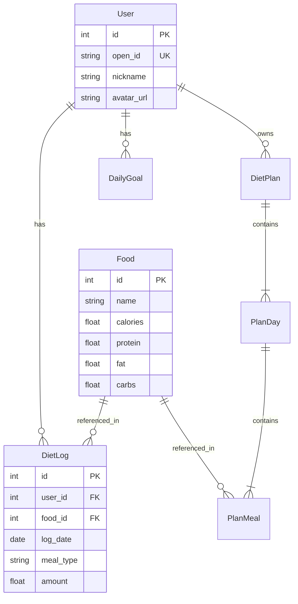

# 接口与数据规约

> **版本**: v1.0
> **日期**: 2026-01-27
> **状态**: 已归档

## 1. 数据库实体模型

### 1.1 实体关系图 (ER Diagram)



### 1.2 核心表结构

#### User (用户表)
| 字段 | 类型 | 说明 |
| :--- | :--- | :--- |
| id | int | PK |
| open_id | varchar | 微信 OpenID (Unique) |
| nickname | varchar | 昵称 |
| avatar_url | varchar | 头像 |
| created_at | datetime | |

#### DietLog (饮食记录表)
| 字段 | 类型 | 说明 |
| :--- | :--- | :--- |
| id | int | PK |
| user_id | int | FK -> User.id |
| food_id | int | FK -> Food.id |
| log_date | date | 记录日期 |
| meal_type | enum | breakfast, lunch, dinner, snack |
| amount | float | 摄入量 |

## 2. API 接口契约

### 2.1 认证 (Auth)

#### U-1: 微信登录
- **POST** `/auth/wechatAuth`
- **Request**: `{ "code": "string" }`
- **Response**: `{ "accessToken": "string", "user": { ... } }`

### 2.2 食物 (Food)

#### F-1: 食物列表
- **GET** `/foods`
- **Query**: `page=1&limit=20&keyword=apple`
- **Response**: `{ "items": [...], "meta": { ... } }`

### 2.3 日志 (Log)

#### L-2: 添加记录
- **POST** `/diet-logs`
- **Request**: 
  ```json
  {
    "foodId": 1,
    "logDate": "2023-10-01",
    "mealType": "breakfast",
    "amount": 100
  }
  ```
- **Response**: `DietLog` 对象

#### L-3: 查询记录
- **GET** `/diet-logs`
- **Query**: `date=2023-10-01`
- **Response**: 包含当日所有记录及营养统计

## 3. 数据字典

- **MealType**: `breakfast`, `lunch`, `dinner`, `snack`
- **PlanStatus**: `active`, `paused`, `completed`, `archived`
