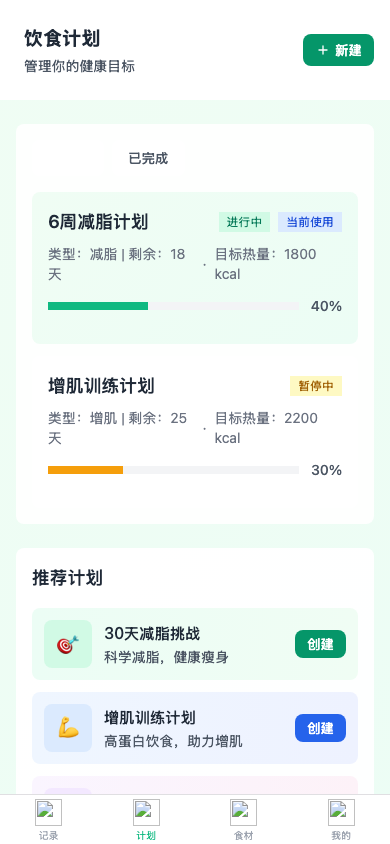
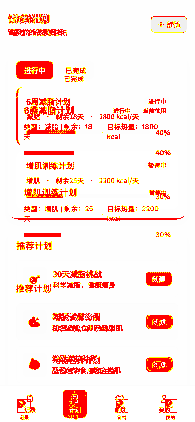

# Visual Audit Report: P-5 Plan List

**Date**: 2026/2/3 15:16:52
**Match Rate**: 90.25%
**Requirement**: 99%

## Evidence
| Prototype | Implementation | Diff |
| :---: | :---: | :---: |
|  |  |  |

## Analysis
- **Status**: ⚠️ FAILED
- **Differences**: 32078 pixels differ.

## Notes
- If mismatch is high, check:
  - Font rendering (system fonts vs web fonts).
  - Dynamic content (dates, times).
  - Scrollbar visibility.
  - Padding/Margin subtleties.
